Leia em: **🇧🇷 Português** | [🇺🇸 English](README.md)
---

# Backend, HTTP e Arquitetura de APIs
### Dos fundamentos da comunicação web à implementação com `net/http` em Go

<br>


<br>

> **Um backend consistente não nasce de endpoints nem de frameworks.**
> Nasce do entendimento profundo de protocolos, contratos bem definidos, regras de negócio isoladas, gerenciamento de estado, segurança aplicada em camadas e operação pensada desde o primeiro commit.
> Código é consequência. Decisão é fundamento.

Este material não começa na rota, no handler ou no framework. Começa antes, na raiz: na origem do backend como disciplina, no papel do servidor dentro de sistemas distribuídos e na semântica que torna uma API previsível, compreensível e operável em produção. HTTP, REST, contratos, serialização, segurança e observabilidade aparecem aqui como partes de um mesmo sistema coeso, não como tópicos isolados. A implementação em Go entra depois, quando a base conceitual já sustenta escolhas técnicas com precisão e intenção.

---

## ✦ Sobre o autor

Desenvolvido por **Jefferson Otoni Lima (Jeffotoni)**, Engenheiro de Software Sênior e Arquiteto de Soluções com mais de **22 anos de experiência** construindo sistemas distribuídos de alta performance. Especialista em design de APIs, arquitetura cloud-native, Go e ecossistemas de backend em escala. Criador do **Quick Framework**, autor do **Go Bootcamp** e contribuidor ativo da comunidade Go no Brasil e no mundo.

[](https://www.linkedin.com/in/jeffotoni)
[](https://github.com/jeffotoni)
[](http://jeffotoni.com)

---

## Estrutura do material

| | Parte | O que você encontra |
|:---:|---|---|
| **I** | Fundamentos de Backend | Origem do backend, papel do servidor, responsabilidades e pilares do backend moderno |
| **II** | HTTP e Semântica de APIs | Métodos, status codes, corpo, cache, restrições REST e comportamento correto de APIs |
| **III** | Servidores e Infraestrutura | Tipos de servidores, serialização, contexto operacional e decisões frequentes em backend real |
| **IV** | Segurança, Observabilidade e Contratos | Autenticação, autorização, HTTPS, logs estruturados, métricas, tracing e versionamento de APIs |
| **V** | Implementação com Go | Pacote `net/http` com profundidade, sem abstração desnecessária e com base conceitual consolidada |

---

## O que está coberto

| Bloco | O que você encontra |
|---|---|
| Fundamentos de backend | Origem do backend, papel do servidor, responsabilidades e pilares do backend moderno |
| HTTP e protocolos | Evolução do HTTP, keep-alive, camadas de rede, TCP, UDP e contexto de comunicação |
| REST e semântica | Constraints, recursos, métodos, status codes, payloads e maturidade de APIs |
| Servidores e infraestrutura | Web servers, reverse proxy, serialização e ferramentas que cercam o backend em produção |
| Segurança | Autenticação vs autorização, JWT, API keys, CORS, HTTPS e rate limiting como decisão de design |
| Observabilidade | Logs estruturados, métricas, tracing distribuído e o que significa um backend operável |
| Design de contratos | Versionamento de APIs, documentação como parte do contrato e evolução sem quebra de clientes |
| Go e `net/http` | Handlers, `Request`, `ResponseWriter`, `ServeMux` e `Server` |
| API server na prática | Padronização de resposta, validação, health endpoints, middleware e execução local |

---

## Objetivos do curso

- Compreender backend como **sistema**, não como uma coleção de rotas e handlers
- Dominar os fundamentos de **HTTP, REST e semântica de APIs** com precisão conceitual
- Entender **segurança e observabilidade** como pilares de design, não como camadas adicionais
- Aprender a **definir e evoluir contratos de API** sem quebrar clientes nem acumular dívida técnica
- Conectar toda a base conceitual com **implementação prática e fundamentada em Go**
- Desenvolver o raciocínio para **tomar decisões técnicas com clareza**, não apenas reproduzir padrões
- Sair do curso capaz de construir, operar e evoluir um **backend de qualidade em produção**

---

## Trilha de conteúdo

| Etapa | Tema |
|:---:|---|
| `1` | Fundamentos de backend, web services e arquitetura cliente-servidor |
| `2` | HTTP, conexões, keep-alive e pilha de protocolos |
| `3` | REST, recursos, semântica de APIs e níveis de maturidade |
| `4` | Servidores, reverse proxy, serialização e contexto de infraestrutura |
| `5` | Segurança: autenticação, autorização, HTTPS, JWT e rate limiting |
| `6` | Observabilidade: logs estruturados, métricas e tracing distribuído |
| `7` | Design de contratos, versionamento e documentação de APIs |
| `8` | Overview de Go para construção de APIs |
| `9` | Fundamentos do `net/http` |
| `10` | Handlers, `ServeMux`, `Server` e fluxo request/response |
| `11` | API server, segurança e execução local com Docker |

---

## Recursos oficiais do manual

| Canal | Link | Objetivo |
|---|---|---|
| Podcast | [O que preciso saber sobre Backend?](https://youtu.be/_E20rA8bWGw) | Revisar os conceitos em formato de áudio |
| Podcast | [Mergulhando no backend](https://youtu.be/fJFQk-yFNxg) | Reforçar o contexto conceitual do material |
| Chat de dúvidas | [NotebookLM, Chat do manual](https://notebooklm.google.com/notebook/c50bab62-0214-4b1a-9d53-78079ffc9fe6/preview) | Tirar dúvidas e reforçar o conteúdo |
| Apresentação | [Google Slides do manual](https://docs.google.com/presentation/d/1To-ymSRme7iyUKflu2ctDfyrlY0NjaRnjKYCHQpu6eE/edit?usp=sharing) | Apoio visual para estudo e aula |
| LinkedIn | [linkedin.com/in/jeffotoni](https://www.linkedin.com/in/jeffotoni) | Perfil profissional do autor |
| GitHub | [github.com/jeffotoni](https://github.com/jeffotoni) | Repositórios e projetos do autor |
| Roadmap Go | [github.com/jeffotoni/groadmap](https://github.com/jeffotoni/groadmap) | Visão macro de estudo e evolução em Go |
| Site | [gonethttplearn](https://jeffotoni.github.io/gonethttplearn/) | Versão do repositório publicada como site |

---

## Referências Go

| Referência | Tipo | Link | Foco |
|---|:---:|---|---|
| Site oficial do Go | Oficial | [go.dev](https://go.dev/) | Portal principal da linguagem |
| ChatBoot com Go | Oficial | [ChatBoot Google Go](https://codewiki.google/github.com/golang/go#community-guidelines-and-support) | Assistente oficial da linguagem |
| Tutorial oficial | Oficial | [go.dev/doc/tutorial](https://go.dev/doc/tutorial/) | Passo a passo para começar |
| Tour do Go | Oficial | [go.dev/tour/welcome/1](https://go.dev/tour/welcome/1) | Aprendizado interativo |
| Especificação da linguagem | Oficial | [go.dev/ref/spec](https://go.dev/ref/spec) | Regras formais da linguagem |
| Effective Go | Oficial | [go.dev/doc/effective_go](https://go.dev/doc/effective_go) | Estilo e boas práticas |
| Notas de release | Oficial | [go.dev/doc/devel/release](https://go.dev/doc/devel/release) | Histórico de versões |
| Notas da versão Go 1.26 | Oficial | [go.dev/doc/go1.26](https://go.dev/doc/go1.26) | Novidades da versão 1.26 |
| Blog do Go 1.26 | Oficial | [go.dev/blog/go1.26](https://go.dev/blog/go1.26?ref=dailydev) | Explicações práticas da release |
| Go by Example | Comunidade | [gobyexample.com](https://gobyexample.com) | Exemplos diretos e curtos |
| Quick Framework | Comunidade | [github.com/jeffotoni/quick](https://github.com/jeffotoni/quick) | Framework leve para APIs em Go |

---

## Referências Jeffotoni: Go e Arquitetura

<details>
<summary><strong>Ver todos os projetos e repositórios</strong></summary>

<br>

| Projeto | Link | Foco |
|---|---|---|
| Go Bootcamp | [gobootcamp.jeffotoni.com](https://gobootcamp.jeffotoni.com/br/index.html) | Trilha completa de aprendizado em Go |
| Site pessoal | [jeffotoni.com](http://jeffotoni.com) | Conteúdo, artigos e materiais do autor |
| Go Manual | [gomanual.jeffotoni.com](https://gomanual.jeffotoni.com/) | Manual de referência em Go |
| Go Roadmap | [github.com/jeffotoni/groadmap](https://github.com/jeffotoni/groadmap) | Visão macro da jornada Go |
| Quick Framework | [github.com/jeffotoni/quick](https://github.com/jeffotoni/quick) | Framework leve e performático para APIs em Go |
| Benchmarks Quick | [github.com/goquick-run/benchmarks](https://github.com/goquick-run/benchmarks) | Comparações de performance entre frameworks |
| Go Example | [github.com/jeffotoni/goexample](https://github.com/jeffotoni/goexample) | Coleção de exemplos práticos em Go |
| Go Cache | [github.com/jeffotoni/gocache](https://github.com/jeffotoni/gocache) | Estratégias de cache em Go |
| Go Hexagonal DDD | [github.com/jeffotoni/go-hexagonal-ddd](https://github.com/jeffotoni/go-hexagonal-ddd) | Arquitetura Hexagonal e DDD em Go |
| Go gRPC Palestra | [github.com/jeffotoni/gogrpc.palestra](https://github.com/jeffotoni/gogrpc.palestra) | Materiais e exemplos de gRPC em Go |
| Go Workshop DevOps | [github.com/jeffotoni/goworkshopdevops](https://github.com/jeffotoni/goworkshopdevops) | Práticas de Go aplicadas a DevOps |
| Benchmark | [github.com/jeffotoni/benchmark](https://github.com/jeffotoni/benchmark) | Estudos e análises de benchmark |

</details>

---

## Sumário

- [Estrutura do material](#estrutura-do-material)
- [O que está coberto](#o-que-está-coberto)
- [Objetivos do curso](#objetivos-do-curso)
- [Trilha de conteúdo](#trilha-de-conteúdo)
- [Recursos oficiais do manual](#recursos-oficiais-do-manual)
- [Referências Go](#referências-go)
- [Referências Jeffotoni](#referências-jeffotoni--go-e-arquitetura)
- [1. Contexto: Web Services, REST e Protocolos](#1-contexto-web-services-rest-e-protocolos)
  - [Panorama de Web Services](#panorama-de-web-services)
  - [Diagramas de comunicação](#diagramas-de-comunicação)
  - [Evolução rápida de HTTP](#evolução-rápida-de-http)
  - [Diagrama Keep-Alive](#diagrama-keep-alive)
  - [Keep-Alive: HTTP/1.0 -> HTTP/1.1 -> HTTP/2](#keep-alive-http10---http11---http2)
  - [HTTP, TCP e UDP (diferença rápida)](#http-tcp-e-udp-diferença-rápida)
  - [Modelo OSI e TCP/IP (diagrama)](#modelo-osi-7-camadas)
  - [Modelo TCP/IP (4 Camadas)](#modelo-tcpip-4-camadas)
  - [REST vs RESTful](#rest-vs-restful)
  - [Significado das Siglas](#significado-das-siglas)
  - [REST Constraints](#rest-constraints)
  - [Diagrama REST Constraints](#diagrama-rest-constraints)
  - [Uniform Interface (detalhado em 4 partes)](#uniform-interface-detalhado-em-4-partes)
  - [Níveis de maturidade (Richardson)](#níveis-de-maturidade-richardson)
  - [Diagrama Richardson](#diagrama-richardson)
  - [HTTP Methods (Verbos HTTP)](#http-methods-verbos-http)
  - [Corpo em REST (request/response) com status na prática](#corpo-em-rest-requestresponse-com-status-na-prática)
  - [Status codes essenciais para APIs](#status-codes-essenciais-para-apis)
  - [Formatos de serialização](#formatos-de-serialização)
  - [Servidores web e aplicação](#servidores-web-e-aplicação)
  - [Servidores Web/Reverse Proxy feitos em Go](#servidores-webreverse-proxy-feitos-em-go)
  - [Ecossistema Go em DevOps](#ecossistema-go-em-devops)
- [2. Overview de Go para APIs](#2-overview-de-go-para-apis)
  - [O que é Go](#o-que-é-go)
  - [Diferenciais de Go para construção de APIs](#diferenciais-de-go-para-construção-de-apis)
  - [Concorrência em Go (simples de entender)](#concorrência-em-go-simples-de-entender)
  - [Compilado, estático e dinâmico (na prática)](#compilado-estático-e-dinâmico-na-prática)
  - [HTTP server built-in](#http-server-built-in)
  - [Palavras-chave oficiais da linguagem (25)](#palavras-chave-oficiais-da-linguagem-25)
- [3. Fundamentos do `net/http`](#3-fundamentos-do-nethttp)
  - [O pacote `net/http`](#o-pacote-nethttp)
  - [Mini referencia dos componentes](#mini-referencia-dos-componentes)
  - [Anatomia mínima de um handler (`w` e `r`)](#anatomia-mínima-de-um-handler-w-e-r)
- [4. Manual Prático: ListenAndServe (Fase Zero)](#4-manual-pratico-listenandserve-fase-zero)
  - [4.1 Diferenca essencial: `HandleFunc` vs `HandlerFunc`](#41-diferenca-essencial-handlefunc-vs-handlerfunc)
  - [4.2 O que `ListenAndServe` aceita](#42-o-que-listenandserve-aceita)
  - [4.3 Variacoes base (sem `ServeMux` custom)](#43-variacoes-base-sem-servemux-custom)
  - [4.4 Algumas possibilidades](#44-algumas-possibilidades)
  - [4.5 `ServeMux` com method pattern + `http.Server`](#45-servemux-com-method-pattern--httpserver)
  - [4.6 Quando usar `http.Handler`?](#46-quando-usar-httphandler)
- [5. Server API](#5-server-api)
  - [5.0 helpers.go: funções compartilhadas](#50-helpergo--funções-compartilhadas)
  - [5.1 Padronizacao de resposta](#51-padronizacao-de-resposta)
  - [5.2 Mapa de erros e status por cenario](#52-mapa-de-erros-e-status-por-cenario)
  - [5.3 Organizacao de rotas](#53-organizacao-de-rotas)
  - [5.4 Validacao de entrada no servidor](#54-validacao-de-entrada-no-servidor)
  - [5.5 Health endpoints](#55-health-endpoints)
  - [5.6 Middleware Basic Auth](#56-middleware-basic-auth)
  - [5.7 Variáveis de ambiente](#57-variáveis-de-ambiente)
  - [5.8 Middleware CORS](#58-middleware-cors)
  - [5.9 Documentação com OpenAPI/Swagger](#59-documentação-com-openapiswagger)
- [6. Docker: build e run local](#6-docker-build-e-run-local)
  - [6.1 Dockerfile multi-stage (Alpine + timezone Brasil)](#61-dockerfile-multi-stage-alpine--timezone-brasil)
  - [6.2 Comandos basicos Docker](#62-comandos-basicos-docker)

---

## 1. Contexto: Web Services, REST e Protocolos

### Panorama de Web Services

| Estilo/Tecnologia | Ano (origem/aparição) | Característica principal | Quando aparece mais |
|---|---:|---|---|
| SOAP | 1998 | Contrato rígido, XML, WSDL | Legado corporativo e integrações formais |
| REST | 2000 | Estilo arquitetural sobre HTTP | APIs web em geral |
| WebHooks | 2007 | Callback HTTP orientado a evento (push do servidor ao cliente) | Pagamentos, integrações, pipelines de CI/CD |
| WebSocket | 2011 | Conexão bidirecional e persistente sobre HTTP | Chats, dashboards em tempo real, jogos |
| SSE (Server-Sent Events) | 2006 | Servidor empurra eventos sobre HTTP comum (unidirecional) | Notificações, streaming de respostas, LLMs |
| GraphQL | 2015 | Cliente define campos da resposta | Cenários com múltiplas visões de dados |
| gRPC | 2015 | RPC com Protobuf sobre HTTP/2 | Comunicação interna de microserviços |


### Diagramas de comunicação

#### SOAP
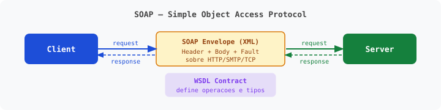

#### REST
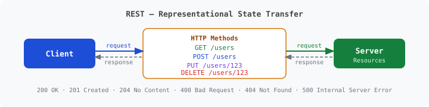

#### WebHooks
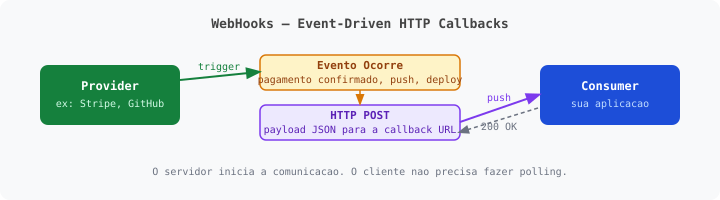

#### WebSocket
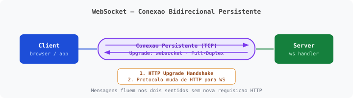

#### SSE (Server-Sent Events)
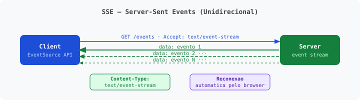

#### GraphQL
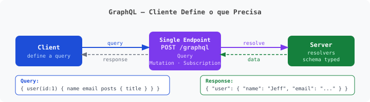

#### gRPC
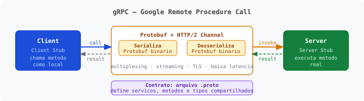

### Evolução rápida de HTTP

| Protocolo | Ano | Destaques |
|---|---:|---|
| HTTP/0.9 | 1991 | Versão original; apenas GET, sem headers, sem status code |
| HTTP/1.0 | 1996 | Headers, status codes e múltiplos tipos de conteúdo; conexão fechada por padrão |
| HTTP/1.1 | 1997 | Keep-alive padrão, pipelining, host obrigatório; base da web por décadas |
| HTTP/2 | 2015 | Binário, multiplexing, compressão de headers (HPACK), server push |
| HTTP/3 | 2022 | QUIC sobre UDP, menor latência em redes instáveis, conexão mais resiliente |

### Keep-Alive: HTTP/1.0 -> HTTP/1.1 -> HTTP/2

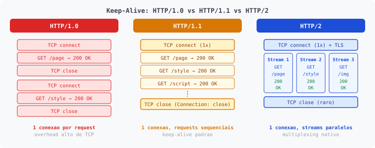


```text
HTTP/1.0 (1996)
├─ Conexao fechada apos CADA request/response
├─ Keep-Alive era OPCIONAL (via header)
└─ Header: Connection: keep-alive (explicito)

HTTP/1.1 (1997)
├─ Keep-Alive e o PADRAO
├─ Conexoes persistentes por default
├─ Para fechar: Connection: close
└─ Melhor performance out-of-the-box

HTTP/2 (2015)
├─ Multiplexing sobre uma unica conexao
├─ Keep-Alive implicito
└─ Multiplas requisicoes simultaneas
```

#### HTTP/1.0 - ativando Keep-Alive

```http
GET /index.html HTTP/1.0
Host: example.com
Connection: keep-alive
```

```http
HTTP/1.0 200 OK
Connection: keep-alive
Keep-Alive: timeout=5, max=100
Content-Type: text/html
Content-Length: 1234

<html>...</html>
```

#### HTTP/1.1 - Keep-Alive por padrao

```http
GET /index.html HTTP/1.1
Host: example.com
```

```http
HTTP/1.1 200 OK
Content-Type: text/html
Content-Length: 1234

<html>...</html>
```

#### HTTP/1.1 - fechando conexao explicitamente

```http
GET /logout HTTP/1.1
Host: example.com
Connection: close
```

```http
HTTP/1.1 200 OK
Connection: close
Content-Type: application/json

{"status":"logged out"}
```

### HTTP, TCP e UDP (diferença rápida)

Referência didática:
- Modelo OSI (7 camadas)
- Modelo TCP/IP (4 camadas, mais usado na prática)

#### Modelo OSI (7 Camadas)

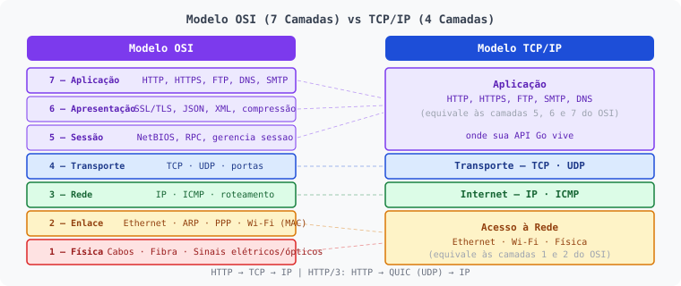


| Camada | Nome | Função Principal | Exemplos de Protocolos / Tecnologias |
|---:|---|---|---|
| 7 | Aplicação | Interface com o usuário e aplicações | HTTP, HTTPS, FTP, SMTP, DNS |
| 6 | Apresentação | Formatação, criptografia, compressão | SSL/TLS, JPEG, MP3, JSON |
| 5 | Sessão | Controle de sessão/conexão | NetBIOS, RPC |
| 4 | Transporte | Comunicação fim a fim, controle de erro | TCP, UDP |
| 3 | Rede | Endereçamento lógico e roteamento | IP, ICMP, IPSec |
| 2 | Enlace | Comunicação dentro da rede local | Ethernet, ARP, PPP |
| 1 | Física | Transmissão elétrica/óptica dos bits | Cabos, Fibra, Wi-Fi (parte física) |

#### Modelo TCP/IP (4 Camadas)

| Camada TCP/IP | Equivalente OSI | Exemplos |
|---|---|---|
| Aplicação | 7, 6 e 5 | HTTP, FTP, SMTP, DNS |
| Transporte | 4 | TCP, UDP |
| Internet | 3 | IP, ICMP |
| Acesso à Rede | 2 e 1 | Ethernet, Wi-Fi |

Resumo rápido da pilha:
- HTTP/1.1 e HTTP/2: `HTTP -> TCP -> IP`
- HTTP/3: `HTTP -> QUIC(UDP) -> IP`

Analogia didática (mensagem e correio):
1. Aplicação: escrever a mensagem
2. Transporte: colocar no envelope (TCP controla se chegou)
3. Rede: escolher rota até o destino
4. Enlace: levar até o correio local
5. Física: estrada e caminhão

Exemplo básico em Go:

```go
http.ListenAndServe(":8080", nil)
```

Ou seja, `net/http` está no topo da pilha, mas depende de todas as camadas abaixo.

### REST vs RESTful

- `REST` é um estilo arquitetural (conjunto de restrições)
- `RESTful` é a API que aplica REST de forma consistente na prática

### Significado das Siglas

| Termo | Significado | Tipo | Onde se encaixa |
|---|---|---|---|
| HTTP | HyperText Transfer Protocol | Protocolo | Camada de Aplicação |
| REST | Representational State Transfer | Estilo arquitetural | Usa HTTP |
| SOAP | Simple Object Access Protocol | Protocolo | Usa HTTP (geralmente) |
| gRPC | Google Remote Procedure Call | Framework / RPC | Usa HTTP/2 |

### REST Constraints

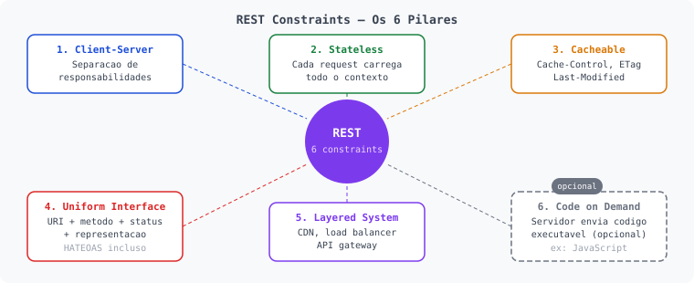


```text
┌───────────────────────────────────────────────────────┐
│ 1. Client-Server                                      │
│    Separação de responsabilidades                     │
│                                                       │
│ 2. Stateless                                          │
│    Cada request é independente                        │
│                                                       │
│ 3. Cacheable                                          │
│    Responses devem indicar cache                      │
│                                                       │
│ 4. Uniform Interface                                  │
│    ├─ Resource identification                         │
│    ├─ Manipulation via representations                │
│    ├─ Self-descriptive messages                       │
│    └─ HATEOAS                                         │
│                                                       │
│ 5. Layered System                                     │
│    Cliente não sabe se conecta direto no servidor     │
│    final ou em camadas intermediárias                 │
│                                                       │
│ 6. Code on Demand (opcional)                          │
│    Server pode enviar código executável               │
└───────────────────────────────────────────────────────┘
```

#### Prévia didática de cada constraint

| Constraint | Prévia prática |
|---|---|
| Client-Server | Frontend e backend evoluem de forma independente |
| Stateless | Token/autenticação e contexto vão em cada requisição |
| Cacheable | Uso de `Cache-Control`, `ETag`, `Last-Modified` |
| Uniform Interface | URI + método + status + representação consistente |
| Layered System | CDN, load balancer e API gateway entre cliente e app |
| Code on Demand | Ex.: JavaScript entregue ao cliente (opcional) |

#### Uniform Interface (detalhado em 4 partes)

**1. Resource Identification (Identificação de Recursos)**

Cada recurso tem um identificador único (URI).

Exemplos:
- `/users/123`
- `/posts/456`

**2. Manipulation via Representations (Manipulação via Representações)**

Cliente manipula recursos através de representações (`JSON`, `XML`, etc).
O servidor envia a representação do recurso, não o recurso em memória.

Exemplo prático:
- o cliente recebe JSON de usuário
- ao fazer `PUT /users/123`, envia nova representação desse usuário

**3. Self-descriptive Messages (Mensagens Auto-descritivas)**

Cada mensagem deve conter informação suficiente para processamento.

```http
Content-Type: application/json
Accept: application/json
```

Com isso, cliente e servidor entendem formato de entrada/saída sem "acordo oculto".

**4. HATEOAS (Hypermedia As The Engine Of Application State)**

A API retorna links para próximas ações válidas, e o cliente navega por esses links.

```json
{
  "id": 123,
  "name": "Joao",
  "links": [
    {"rel": "self", "href": "/users/123"},
    {"rel": "posts", "href": "/users/123/posts"},
    {"rel": "delete", "href": "/users/123", "method": "DELETE"}
  ]
}
```

Na prática, HATEOAS é o item menos implementado na maioria das APIs RESTful.

Motivos comuns:
- clientes mobile/web preferem contrato fixo documentado em OpenAPI/Swagger
- equipes priorizam simplicidade de implementação e manutenção
- gateways, versionamento e SDKs tendem a centralizar fluxo fora da hipermídia
- custo extra de modelagem nem sempre gera benefício claro no produto

### Níveis de maturidade (Richardson)

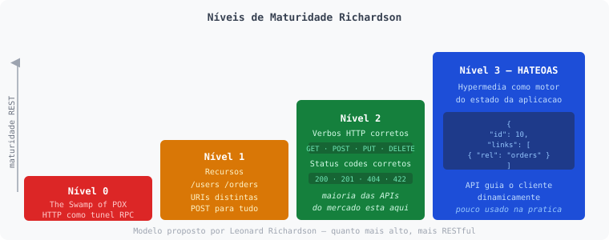


O modelo foi proposto por **Leonard Richardson**, arquiteto de software que escreveu sobre APIs REST e ajudou a popularizar boas práticas na construção de serviços HTTP.

Objetivo do modelo:
- avaliar o quão RESTful uma API é
- classificar APIs HTTP em níveis de maturidade
- ajudar a evoluir APIs de RPC disfarçado para REST mais bem estruturado

Ele possui 4 níveis (0 a 3).

| Nível | Nome | Descrição |
|---:|---|---|
| 0 | POX / RPC over HTTP | HTTP só como transporte |
| 1 | Recursos | Recursos identificados por URI |
| 2 | Verbos + status | Uso correto de verbos HTTP e status codes |
| 3 | HATEOAS | Hipermídia guiando o cliente |

#### Nível 0 - The Swamp of POX

- usa HTTP apenas como transporte
- normalmente um único endpoint
- comum ver `POST` para tudo

Exemplo:

```http
POST /api
Content-Type: application/json

{
  "action": "getUser",
  "id": 10
}
```

Aqui o HTTP vira só um "túnel" para comandos RPC.

#### Nível 1 - Recursos

- separa por recursos (URLs diferentes)
- ainda pode usar `POST` para quase tudo

Exemplos de recursos:
- `/users`
- `/orders`

Ganho principal: começo de organização por domínio.

#### Nível 2 - Verbos HTTP corretos

- usa `GET`, `POST`, `PUT`, `DELETE` corretamente
- usa status codes adequados

Exemplos:

```http
GET /users/10
DELETE /users/10
```

Aqui está a maioria das APIs que o mercado chama de REST na prática.

#### Nível 3 - HATEOAS

`HATEOAS` = *Hypermedia As The Engine Of Application State*.

A resposta inclui links para próximos passos possíveis.

```json
{
  "id": 10,
  "name": "Jefferson",
  "links": [
    {"rel": "orders", "href": "/users/10/orders"},
    {"rel": "delete", "href": "/users/10"}
  ]
}
```

Aqui a API guia o cliente dinamicamente.

Na prática:
- a maioria das APIs modernas fica no nível 2
- poucas implementam HATEOAS de forma completa
- muitas APIs se dizem REST, mas ainda estão no nível 1

### HTTP Methods (Verbos HTTP)

| Verbo | Uso Correto | Exemplo |
|---|---|---|
| `GET` | Buscar dados | `GET /users/123` |
| `POST` | Criar | `POST /users` |
| `PUT` | Substituir | `PUT /users/123` |
| `PATCH` | Atualizar parcialmente | `PATCH /users/123` |
| `DELETE` | Remover | `DELETE /users/123` |

### Corpo em REST (request/response) com status na prática

Regras simples:
- `GET` e `DELETE`: normalmente sem body
- `POST`, `PUT`, `PATCH`: normalmente com body
- Sempre definir `Content-Type` e validar entrada

#### GET (buscar recurso)

```http
GET /users/123
Accept: application/json
```

```http
HTTP/1.1 200 OK
Content-Type: application/json

{
  "id": 123,
  "name": "Jeff Otoni"
}
```

```http
HTTP/1.1 404 Not Found
Content-Type: application/json

{
  "error": "user_not_found"
}
```

#### POST (criar recurso)

```http
POST /users
Content-Type: application/json

{
  "name": "Jeff Otoni",
  "email": "jeff@email.com"
}
```

```http
HTTP/1.1 201 Created
Location: /users/123
Content-Type: application/json

{
  "id": 123,
  "name": "Jeff Otoni",
  "email": "jeff@email.com"
}
```

```http
HTTP/1.1 422 Unprocessable Entity
Content-Type: application/json

{
  "error": "validation_failed",
  "details": {
    "email": "invalid format"
  }
}
```

#### PUT (substituir recurso)

```http
PUT /users/123
Content-Type: application/json

{
  "name": "Jeff Otoni",
  "email": "novo@email.com"
}
```

```http
HTTP/1.1 200 OK
Content-Type: application/json

{
  "id": 123,
  "name": "Jeff Otoni",
  "email": "novo@email.com"
}
```

```http
HTTP/1.1 404 Not Found
Content-Type: application/json

{
  "error": "user_not_found"
}
```

#### PATCH (atualização parcial)

```http
PATCH /users/123
Content-Type: application/json

{
  "email": "patch@email.com"
}
```

```http
HTTP/1.1 200 OK
Content-Type: application/json

{
  "id": 123,
  "name": "Jeff Otoni",
  "email": "patch@email.com"
}
```

#### DELETE (remover recurso)

```http
DELETE /users/123
```

```http
HTTP/1.1 204 No Content
```

```http
HTTP/1.1 404 Not Found
Content-Type: application/json

{
  "error": "user_not_found"
}
```

### Status codes essenciais para APIs

| Cenário | Status |
|---|---|
| Sucesso com retorno | `200 OK` |
| Criação de recurso | `201 Created` |
| Sucesso sem corpo | `204 No Content` |
| Erro de entrada | `400 Bad Request` |
| Não autenticado | `401 Unauthorized` |
| Sem permissão | `403 Forbidden` |
| Não encontrado | `404 Not Found` |
| Conflito de estado | `409 Conflict` |
| Erro de validação semântica | `422 Unprocessable Entity` |
| Erro interno | `500 Internal Server Error` |
| Requisições em excesso | `429 Too Many Requests` |

### Formatos de serialização

Para este curso, o foco principal será `JSON` em APIs REST com Go.

| Formato | Tipo | Quando usar |
|---|---|---|
| JSON | Texto | APIs REST públicas e simplicidade |
| Protobuf | Binário | gRPC e comunicação interna de alta performance |
| Avro | Binário | Streaming/Kafka com evolução forte de schema |
| MessagePack | Binário | Payload mais compacto sem muita complexidade |
| CBOR | Binário | IoT e cenários com padrão IETF |

Exemplo mínimo em Go:

```go
package main

import (
	"encoding/json"
	"fmt"
)

type User struct {
	Name  string `json:"name"`
	Email string `json:"email"`
}

func main() {
	// Serializar (struct -> JSON)
	u := User{Name: "Jeff", Email: "jeff@email.com"}
	b, _ := json.Marshal(u)
	fmt.Println(string(b)) // {"name":"Jeff","email":"jeff@email.com"}

	// Deserializar (JSON -> struct)
	var u2 User
	_ = json.Unmarshal(b, &u2)
	fmt.Println(u2.Name) // Jeff
}
```

### Servidores web e aplicação

| Servidor | Ano | Categoria | Observação |
|---|---:|---|---|
| Apache HTTP Server | 1995 | Web Server | Base histórica da web open source |
| IIS | 1995 | Web Server | Servidor web da Microsoft |
| nginx | 2004 | Web Server/Reverse Proxy | Muito usado em alta concorrência |
| Caddy | 2015 | Web Server | HTTPS automático por padrão |
| Tomcat | 1999 | Application Server (Java) | Muito comum em aplicações Java |
| JBoss / WildFly | 2006 (WildFly 2014) | Application Server (Java) | Linha enterprise do ecossistema Java |

### Servidores Web/Reverse Proxy feitos em Go

| Projeto | Categoria | Onde aparece muito | Por que Go ajuda aqui |
|---|---|---|---|
| Caddy | Web server / reverse proxy | APIs, TLS automático, edge simples | Binário único, concorrência nativa e deploy fácil |
| Traefik | Reverse proxy / ingress | Docker, Kubernetes, service discovery | Integração cloud-native e alta performance de rede |
| Fabio | Load balancer / reverse proxy | Ambientes com Consul | Simplicidade operacional e bom modelo concorrente |
| `httputil.ReverseProxy` | Reverse proxy (stdlib) | APIs internas, proxies simples sem dependencia extra | Nativo na stdlib `net/http/httputil`, zero dependencias |

### Market share (visão macro)


### Ecossistema Go em DevOps

Go se tornou uma das linguagens centrais do ecossistema **CNCF/DevOps** por entregar:
- Binários portáveis e simples de distribuir
- Boa performance de rede e concorrência
- Toolchain estável para projetos de infraestrutura

| Ferramenta | Categoria | Relação com Go |
|---|---|---|
| Docker (Moby/Engine) | Containerização | Implementação central em Go (com partes em outras linguagens) |
| Kubernetes | Orquestração | Projeto core em Go |
| Consul | Service discovery/config | Core em Go |
| etcd | KV distribuído | Core em Go |
| Terraform | Infrastructure as Code | Core em Go |
| Vault | Secrets management | Core em Go |
| CockroachDB | Banco distribuído SQL | Core majoritariamente em Go |
| InfluxDB | Time-series database | Forte uso de Go no core |
| Prometheus | Monitoramento | Core em Go |
| Grafana | Observabilidade | Backend em Go (frontend em TypeScript) |
| Gitea | Git forge/self-hosted | Core em Go |
| Helm | Package manager Kubernetes | Core em Go |
| ArgoCD | GitOps / CD para Kubernetes | Core em Go |
| Cilium | Networking / eBPF para Kubernetes | Core em Go |

---

## 2. Overview de Go para APIs

### O que é Go

Go é uma linguagem compilada, de tipagem estática e sintaxe simples, focada em produtividade, performance e legibilidade.

### Ano de lançamento e principais nomes

| Item | Informação |
|---|---|
| Início do projeto | 2007 (Google) |
| Lançamento público | 2009 |
| Versão 1.0 | 2012 |
| Criadores | Robert Griesemer, Rob Pike, Ken Thompson |

### Diferenciais de Go para construção de APIs

- Biblioteca padrão forte (`net/http`, `encoding/json`, `context`, `database/sql`)
- Compilação rápida e deploy simples (binário único)
- Concorrência nativa com goroutines e channels
- Código mais previsível e com menos complexidade acidental
- Excelente robustez para APIs de alta carga e baixa latência
- Testes integrados no toolchain (`go test`) com suporte prático a testes unitários e table-driven
- Cobertura, benchmark e fuzz testing nativos (`-cover`, `-bench`, `-fuzz`) para elevar confiabilidade da API
- `context.Context` nativo para cancelamento, timeout e propagação de valores entre handlers e goroutines
- Cross-compilation nativa: compile para qualquer OS/arquitetura com `GOOS` e `GOARCH` sem toolchain adicional

### Concorrência em Go (simples de entender)

- `goroutine`: função executando concorrentemente com baixo custo
- `channel`: canal seguro para comunicação entre goroutines
- `select`: coordena múltiplos canais e timeouts

Modelo mental:
1. Use goroutines para estruturar trabalho concorrente (não confundir com paralelismo)
2. Troque dados por channels (em vez de compartilhar memória sempre)
3. Controle cancelamento e prazo com `context.Context`
4. O runtime/scheduler decide quando há paralelismo real (ex.: múltiplos núcleos)

Exemplo mínimo com goroutine + channel:

```go
package main

import "fmt"

func soma(a, b int, ch chan int) {
	ch <- a + b
}

func main() {
	ch := make(chan int)
	go soma(3, 7, ch) // executa concorrentemente
	resultado := <-ch  // aguarda o valor chegar
	fmt.Println(resultado) // 10
}
```

Exemplo com `context.Context`, timeout em handler:

```go
func handler(w http.ResponseWriter, r *http.Request) {
	ctx, cancel := context.WithTimeout(r.Context(), 3*time.Second)
	defer cancel()

	select {
	case <-ctx.Done():
		http.Error(w, "timeout", http.StatusGatewayTimeout)
	case result := <-fetchData(ctx):
		w.Write(result)
	}
}
```

### Compilado, estático e dinâmico (na prática)

| Aspecto | Como funciona em Go |
|---|---|
| Compilação | AOT (ahead-of-time), gera binário nativo |
| Tipagem | Estática e forte em tempo de compilação |
| Linkagem | Normalmente estática; pode usar dinâmica em cenários com `cgo` |
| Runtime | Dinâmico para GC, scheduler e reflexão quando necessário |
| Cross-compilation | `GOOS=linux GOARCH=amd64 go build` gera binário para qualquer plataforma |

Exemplo de cross-compilation:

```bash
# Compilar para Linux AMD64 (a partir de qualquer OS)
GOOS=linux GOARCH=amd64 go build -o server-linux ./cmd/api

# Compilar para Windows
GOOS=windows GOARCH=amd64 go build -o server.exe ./cmd/api

# Compilar para ARM (ex: Raspberry Pi)
GOOS=linux GOARCH=arm64 go build -o server-arm ./cmd/api
```

### Go hoje é escrito em Go

Desde o Go 1.5, o compilador principal é self-hosted (escrito em Go).
Ainda existem partes de baixo nível em assembly.

### HTTP server built-in

Go já traz servidor HTTP embutido na stdlib via `net/http`.

```go
http.HandleFunc("/ping", func(w http.ResponseWriter, r *http.Request) {
    w.Write([]byte("pong"))
})
http.ListenAndServe(":8080", nil)
```

Isso não substitui todos os papéis de um nginx/reverse proxy, mas acelera muito o desenvolvimento de APIs.

### Palavras-chave oficiais da linguagem (25)

| 1 | 2 | 3 | 4 | 5 |
|---|---|---|---|---|
| `break` | `default` | `func` | `interface` | `select` |
| `case` | `defer` | `go` | `map` | `struct` |
| `chan` | `else` | `goto` | `package` | `switch` |
| `const` | `fallthrough` | `if` | `range` | `type` |
| `continue` | `for` | `import` | `return` | `var` |

---

## 3. Fundamentos do `net/http`

### O pacote `net/http`

O pacote oferece:
- Cliente HTTP
- Servidor HTTP
- `Request` e `ResponseWriter`
- `Handler`, `HandlerFunc` e `ServeMux`
- Utilitários de cookies, headers e mais

Componentes:
- `http.ListenAndServe`
- `http.Request`
- `http.ResponseWriter`
- `http.HandleFunc`
- `http.HandlerFunc`
- `http.Handle`
- `http.Handler`
- `http.ServeMux`
- `http.Server`

### Mini referencia dos componentes

**`http.ListenAndServe`**

```go
log.Fatal(http.ListenAndServe(":8080", nil))
```

**`http.Request` e `http.ResponseWriter`:**

```go
func echo(w http.ResponseWriter, r *http.Request) {
	id := r.URL.Query().Get("id")

	w.Header().Set("Content-Type", "text/plain; charset=utf-8")
	w.WriteHeader(http.StatusOK)
	_, _ = w.Write([]byte("method=" + r.Method + " path=" + r.URL.Path + " id=" + id))
}
```

**`http.HandleFunc`:**
```go
http.HandleFunc("/ping", func(w http.ResponseWriter, r *http.Request) {
	_, _ = w.Write([]byte("pong"))
})

log.Fatal(http.ListenAndServe(":8080", nil))
```

**`http.HandlerFunc`**

```go
handler := http.HandlerFunc(func(w http.ResponseWriter, r *http.Request) {
	_, _ = w.Write([]byte("pong"))
})

log.Fatal(http.ListenAndServe(":8080", handler))
```

**`http.Handle`**

```go
http.Handle("/ping", http.HandlerFunc(func(w http.ResponseWriter, r *http.Request) {
	_, _ = w.Write([]byte("pong"))
}))

log.Fatal(http.ListenAndServe(":8080", nil))
```

**`http.Handler`**

```go
type PingHandler struct{}

func (PingHandler) ServeHTTP(w http.ResponseWriter, r *http.Request) {
	_, _ = w.Write([]byte("pong"))
}

log.Fatal(http.ListenAndServe(":8080", PingHandler{}))
```

**`http.ServeMux`**

```go
mux := http.NewServeMux()
mux.HandleFunc("GET /ping", func(w http.ResponseWriter, r *http.Request) {
	_, _ = w.Write([]byte("pong"))
})

log.Fatal(http.ListenAndServe(":8080", mux))
```

**`http.Server`**

```go
srv := &http.Server{
	Addr:    ":8080",
	Handler: mux,
}

log.Fatal(srv.ListenAndServe())
```

Regra mental rapida:
- `HandleFunc`: funcao
- `HandlerFunc`: funcao adaptada para `Handler`
- `Handle`: registra um `Handler`
- `Handler`: comportamento completo (`ServeHTTP`)

### Anatomia mínima de um handler (`w` e `r`)

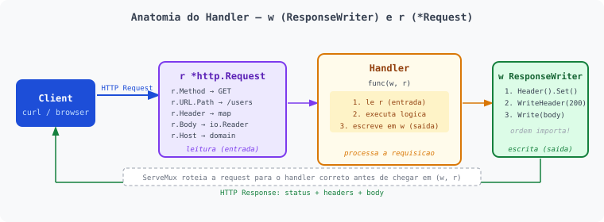


**Assinatura padrão**

```go
func(w http.ResponseWriter, r *http.Request)
```

**w `http.ResponseWriter`:**
- e a saida da sua API (resposta para o cliente)
- pense na ordem: **Headers -> Status -> Body**

**Metodos principais de `ResponseWriter`**

| Metodo | O que faz | Observacoes importantes |
|---|---|---|
| `Header() http.Header` | Manipula headers da resposta | Defina antes do `WriteHeader` |
| `Write([]byte)` | Escreve o body | Se nao chamar `WriteHeader`, envia `200` automaticamente |
| `WriteHeader(statusCode int)` | Define status HTTP | Deve ser chamado uma vez |

Exemplo curto:

```go
w.Header().Set("Content-Type", "application/json")
w.WriteHeader(http.StatusCreated)
_, _ = w.Write([]byte(`{"ok":true}`))
```

**Regras importantes**
- depois de `WriteHeader`, os headers ficam congelados
- `Write()` chama implicitamente `WriteHeader(200)` se nenhum status foi enviado
- ordem correta:
1. `Header().Set(...)`
2. `WriteHeader(...)`
3. `Write(...)`

**r `*http.Request`:**
- representa tudo que o cliente enviou na requisicao

**Campos mais usados de `Request`**

| Campo | Tipo | Para que serve |
|---|---|---|
| `r.Method` | `string` | Verbo HTTP (`GET`, `POST`, etc.) |
| `r.URL` | `*url.URL` | Path e query string (`r.URL.Path`, `r.URL.Query().Get("id")`) |
| `r.Header` | `http.Header` | Headers da requisicao |
| `r.Body` | `io.ReadCloser` | Corpo da requisicao |
| `r.Host` | `string` | Host chamado |
| `r.RemoteAddr` | `string` | IP/porta de origem do cliente |
| `r.Proto` | `string` | Protocolo (`HTTP/1.1`, `HTTP/2.0`) |
| `r.ContentLength` | `int64` | Tamanho do body |

**Anatomia da URL (cada pedaco)**

Exemplo:

```text
https://domain.com/api/v1/user?id=123&debug=true#secao
```

| Parte da URL | Exemplo | Onde usar no servidor Go |
|---|---|---|
| Protocolo (scheme) | `https` | inferir via `r.TLS` (`nil` = http, diferente de nil = https) |
| Host | `domain.com` | `r.Host` |
| Path | `/api/v1/user` | `r.URL.Path` |
| Query string bruta | `id=123&debug=true` | `r.URL.RawQuery` |
| Query params | `id=123`, `debug=true` | `r.URL.Query().Get("id")`, `r.URL.Query().Get("debug")` |
| Fragmento | `#secao` | nao chega no servidor (browser nao envia no request HTTP) |

Exemplo pratico no handler:

```go
scheme := "http"
if r.TLS != nil {
	scheme = "https"
}

fullURL := scheme + "://" + r.Host + r.URL.RequestURI()
// fullURL => https://domain.com/api/v1/user?id=123&debug=true
```

**Campos e metodos uteis de `r.URL` (`*url.URL`)**

| Expressao | Tipo | Para que serve |
|---|---|---|
| `r.URL.Path` | `string` | Caminho da rota sem query (`/api/v1/user`) |
| `r.URL.RawQuery` | `string` | Query string crua (`id=10&debug=true`) |
| `r.URL.Query()` | `url.Values` | Mapa de parametros da query |
| `r.URL.Query().Get("id")` | `string` | Pega o primeiro valor da chave |
| `r.URL.Query()["tag"]` | `[]string` | Pega todos os valores da chave repetida |
| `r.URL.EscapedPath()` | `string` | Path escapado para URL |
| `r.URL.String()` | `string` | URL em formato texto (bom para log/debug) |

Trabalhando com headers:

```go
r.Header.Get("Authorization")
r.Header.Get("Content-Type")
```

Trabalhando com body JSON:

```go
defer r.Body.Close()
_ = json.NewDecoder(r.Body).Decode(&payload)
```

Boa pratica: limitar tamanho do body:

```go
r.Body = http.MaxBytesReader(w, r.Body, 1<<20) // 1MB
```

**`r.PathValue` (Go 1.22+): extraindo segmentos da rota:**

Quando o pattern da rota contém `{nome}`, o valor é extraído com `r.PathValue("nome")`:

```go
mux.HandleFunc("GET /users/{id}", func(w http.ResponseWriter, r *http.Request) {
	id := r.PathValue("id") // extrai "42" de /users/42
	_, _ = fmt.Fprintf(w, `{"id":"%s"}`, id)
})
```

| Expressão | Tipo | Para que serve |
|---|---|---|
| `r.PathValue("id")` | `string` | Segmento nomeado da rota (`/users/{id}`) |
| `r.URL.Query().Get("q")` | `string` | Parâmetro de query (`?q=valor`) |
| `r.URL.Query()["tag"]` | `[]string` | Múltiplos valores da mesma chave (`?tag=a&tag=b`) |

---

## 4. Manual Pratico: ListenAndServe (Fase Zero)

Nesta fase, o `README.md` e o manual principal para copiar, colar e executar.

Observacao pratica:
- cada exemplo usa a porta `:8080`

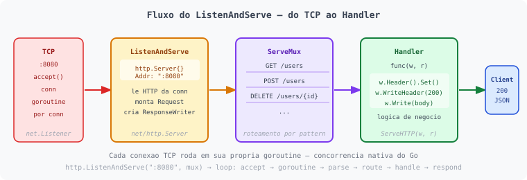

- execute um exemplo por vez (pare o anterior antes de rodar o proximo)

### Linha de raciocinio da aula

| Ordem | Foco | Resultado para o aluno |
|---|---|---|
| 1 | `HandleFunc` vs `HandlerFunc` | Evita os erros mais comuns de registro |
| 2 | O que `ListenAndServe` aceita | Sabe passar `nil`, `HandlerFunc`, `ServeMux` ou tipo custom |
| 3 | Variações base sem `ServeMux` custom | Domina o fluxo básico HTTP |
| 4 | Lendo a request: method, path, query, headers, body, `PathValue` | Extrai qualquer dado da requisição |
| 5 | Escrevendo a response: headers, status, body | Sabe a ordem correta e evita bugs |
| 6 | CRUD completo: GET, POST, PUT, PATCH, DELETE | Cobre os verbos com exemplos reais |
| 7 | `http.Server` com timeouts | Configura servidor para produção |
| 8 | Middleware: Logger, Auth, cadeia | Compõe comportamento reutilizável |
| 9 | Padronização de resposta: motivação do `writeJSON` | Entende por que a seção 5 existe |
| 10 | Graceful shutdown | Encerra o servidor sem perder requisições em andamento |
| 11 | Testando handlers com `httptest` | Testa handlers sem subir servidor real |

### 4.1 Diferenca essencial: `HandleFunc` vs `HandlerFunc`

`HandleFunc` e funcao de registro.
`HandlerFunc` e tipo adaptador (vira `http.Handler`).

```go
// ERRADO - HandleFunc nao retorna nada
http.Handle("/rota", http.HandleFunc(...))

// CERTO - HandlerFunc e um tipo
http.Handle("/rota", http.HandlerFunc(...))

// CERTO - HandleFunc registra direto
http.HandleFunc("/rota", ...)
```

### 4.2 O que `ListenAndServe` aceita

Assinatura:

```go
func ListenAndServe(addr string, handler Handler) error
```

O segundo argumento aceita qualquer coisa que implemente a interface `http.Handler`, ou seja, qualquer tipo que tenha o método `ServeHTTP(w, r)`.

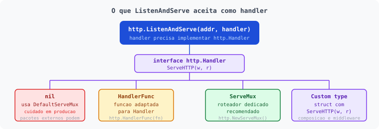

| Opção | Quando usar |
|---|---|
| `nil` | Usa o `DefaultServeMux` global. Simples para exemplos, mas evite em produção |
| `http.HandlerFunc(fn)` | Adapta uma função diretamente como handler. Útil para servidor de rota única |
| `http.NewServeMux()` | Roteador dedicado e isolado. Recomendado para qualquer API real |
| Custom type com `ServeHTTP` | Quando você precisa de estado interno, composição ou cadeia de middlewares |

**Sobre o `DefaultServeMux` e por que evitá-lo em produção:**

O `DefaultServeMux` é um `*ServeMux` global criado automaticamente pelo pacote `net/http`. Ao passar `nil`, o servidor usa esse mux implicitamente. O problema: qualquer pacote importado pode registrar rotas nele via `init()`, criando rotas invisíveis e potencialmente expostas sem intenção.

```go
// CUIDADO: qualquer import pode ter feito isso em init()
import _ "algum/pacote" // pode ter registrado /debug/pprof, /metrics, etc.

http.ListenAndServe(":8080", nil) // expõe essas rotas sem você saber
```

Prefira sempre um `ServeMux` próprio:

```go
mux := http.NewServeMux()
mux.HandleFunc("GET /ping", pingHandler)
http.ListenAndServe(":8080", mux) // apenas suas rotas
```

**Tipo custom com `ServeHTTP` na prática:**

```go
package main

import (
	"fmt"
	"log"
	"net/http"
)

type App struct {
	version string
}

func (a App) ServeHTTP(w http.ResponseWriter, r *http.Request) {
	switch r.URL.Path {
	case "/ping":
		_, _ = w.Write([]byte("pong"))
	case "/version":
		_, _ = fmt.Fprintf(w, `{"version":"%s"}`, a.version)
	default:
		http.NotFound(w, r)
	}
}

func main() {
	app := App{version: "1.0.0"}
	log.Fatal(http.ListenAndServe(":8080", app))
}
```

**`http.Server` como alternativa recomendada para produção:**

`http.ListenAndServe` é conveniente mas não permite configurar timeouts. Para produção use sempre `http.Server`:

```go
srv := &http.Server{
	Addr:              ":8080",
	Handler:           mux,           // seu ServeMux dedicado
	ReadHeaderTimeout: 5 * time.Second,
	ReadTimeout:       15 * time.Second,
	WriteTimeout:      15 * time.Second,
	IdleTimeout:       60 * time.Second,
}
log.Fatal(srv.ListenAndServe())
```

### 4.3 Variacoes base (sem `ServeMux` custom)

#### Exemplo 4.3.1 - `DefaultServeMux` com `HandleFunc`

```go
package main

import (
	"log"
	"net/http"
)

func main() {
	http.HandleFunc("/", func(w http.ResponseWriter, r *http.Request) {
		_, _ = w.Write([]byte("Home"))
	})

	http.HandleFunc("/api", func(w http.ResponseWriter, r *http.Request) {
		_, _ = w.Write([]byte("API"))
	})

	log.Fatal(http.ListenAndServe(":8080", nil))
}
```

Executar:

```bash
go run main.go
curl -i localhost:8080/
curl -i localhost:8080/api
```

#### Exemplo 4.3.2 - `DefaultServeMux` com `Handle`

```go
package main

import (
	"log"
	"net/http"
)

func main() {
	http.Handle("/", http.HandlerFunc(func(w http.ResponseWriter, r *http.Request) {
		_, _ = w.Write([]byte("Home"))
	}))

	http.Handle("/api", http.HandlerFunc(func(w http.ResponseWriter, r *http.Request) {
		_, _ = w.Write([]byte("API"))
	}))

	log.Fatal(http.ListenAndServe(":8080", nil))
}
```

Executar:

```bash
go run main.go
curl -i localhost:8080/
curl -i localhost:8080/api
```

#### Exemplo 4.3.3 - Handler único direto (roteamento manual)

```go
package main

import (
	"log"
	"net/http"
)

func main() {
	log.Fatal(http.ListenAndServe(":8080",
		http.HandlerFunc(func(w http.ResponseWriter, r *http.Request) {
			switch r.URL.Path {
			case "/":
				_, _ = w.Write([]byte("Home"))
			case "/api":
				_, _ = w.Write([]byte("API"))
			default:
				w.WriteHeader(http.StatusNotFound)
				_, _ = w.Write([]byte("Not Found"))
			}
		}),
	))
}
```

Executar:

```bash
go run main.go
curl -i localhost:8080/
curl -i localhost:8080/api
curl -i localhost:8080/x
```

#### Exemplo 4.3.4 - Extrair `HandlerFunc` para variável

```go
package main

import (
	"log"
	"net/http"
)

func main() {
	meuHandler := http.HandlerFunc(func(w http.ResponseWriter, r *http.Request) {
		_, _ = w.Write([]byte("Handler extraido"))
	})

	log.Fatal(http.ListenAndServe(":8080", meuHandler))
}
```

Executar:

```bash
go run main.go
curl -i localhost:8080/
```

#### Exemplo 4.3.5 - Converter para `HandlerFunc`

```go
package main

import (
	"log"
	"net/http"
)

func minhaFuncao(w http.ResponseWriter, r *http.Request) {
	_, _ = w.Write([]byte("Funcao normal convertida em Handler"))
}

func main() {
	log.Fatal(http.ListenAndServe(":8080", http.HandlerFunc(minhaFuncao)))
}
```

Executar:

```bash
go run main.go
curl -i localhost:8080/
```

### 4.4 Algumas possibilidades

#### Exemplo 4.4.1 - Parâmetros de URL (`r.URL.Query`)

```go
package main

import (
	"fmt"
	"log"
	"net/http"
)

func main() {
	http.HandleFunc("/hello", func(w http.ResponseWriter, r *http.Request) {
		name := r.URL.Query().Get("name")
		_, _ = fmt.Fprintf(w, "Hello, %s!", name)
	})

	log.Fatal(http.ListenAndServe(":8080", nil))
}
```

Executar:

```bash
go run main.go
curl -i "localhost:8080/hello?name=jeff"
curl -i localhost:8080/hello
```

#### Exemplo 4.4.2 - Resposta JSON

```go
package main

import (
	"encoding/json"
	"log"
	"net/http"
)

func main() {
	http.HandleFunc("/api/user", func(w http.ResponseWriter, r *http.Request) {
		w.Header().Set("Content-Type", "application/json")
		_ = json.NewEncoder(w).Encode(map[string]string{
			"name": "Joao",
			"role": "Developer",
		})
	})

	log.Fatal(http.ListenAndServe(":8080", nil))
}
```

Executar:

```bash
go run main.go
curl -i localhost:8080/api/user
```

#### Exemplo 4.4.3 - Headers customizados + status code

```go
package main

import (
	"log"
	"net/http"
)

func main() {
	http.HandleFunc("/", func(w http.ResponseWriter, r *http.Request) {
		w.Header().Set("X-Custom-Header", "DevopsBH")
		w.Header().Set("Content-Type", "text/plain; charset=utf-8")
		w.WriteHeader(http.StatusOK)
		_, _ = w.Write([]byte("Response com headers customizados"))
	})

	log.Fatal(http.ListenAndServe(":8080", nil))
}
```

Executar:

```bash
go run main.go
curl -i localhost:8080/
```


#### Exemplo 4.4.4 - Query params com múltiplos valores

```go
package main

import (
	"fmt"
	"log"
	"net/http"
	"strings"
)

func main() {
	http.HandleFunc("/search", func(w http.ResponseWriter, r *http.Request) {
		// ?tag=go&tag=api&tag=http -> ["go", "api", "http"]
		tags := r.URL.Query()["tag"]
		q := r.URL.Query().Get("q")
		w.Header().Set("Content-Type", "application/json")
		_, _ = fmt.Fprintf(w,
			`{"q":"%s","tags":["%s"]}`,
			q, strings.Join(tags, `","`))
	})
	 log.Fatal(http.ListenAndServe(":8080", nil))
}
```

Executar:

```bash
go run main.go
curl -i "localhost:8080/search?q=golang&tag=go&tag=api&tag=http"
```

#### Exemplo 4.4.5 - Lendo headers customizados da request

```go
package main

import (
	"fmt"
	"log"
	"net/http"
)

func main() {
	http.HandleFunc("/info", func(w http.ResponseWriter, r *http.Request) {
		auth := r.Header.Get("Authorization")
		traceID := r.Header.Get("X-Trace-Id")
		clientVersion := r.Header.Get("X-Client-Version")
		w.Header().Set("Content-Type", "application/json")
		_, _ = fmt.Fprintf(w,
			`{"auth_present":%v,"trace_id":"%s","client_version":"%s"}`,
			auth != "", traceID, clientVersion)
	})
	log.Fatal(http.ListenAndServe(":8080", nil))
}
```

Executar:

```bash
go run main.go
curl -i localhost:8080/info \
	-H "Authorization: Bearer token123" \
	-H "X-Trace-Id: abc-456" \
	-H "X-Client-Version: 2.1.0"
```

#### Exemplo 4.4.6 - `r.PathValue` (Go 1.22+)

`r.PathValue` extrai segmentos nomeados diretamente do pattern da rota.

```go
package main

import (
	"fmt"
	"log"
	"net/http"
)

func main() {
	mux := http.NewServeMux()
	mux.HandleFunc("GET /users/{id}", func(w http.ResponseWriter, r *http.Request) {
		id := r.PathValue("id")
		w.Header().Set("Content-Type", "application/json")
		_, _ = fmt.Fprintf(w, `{"id":"%s"}`, id)
	})
	mux.HandleFunc("GET /posts/{postID}/comments/{commentID}", func(w http.ResponseWriter, r *http.Request) {
		postID := r.PathValue("postID")
		commentID := r.PathValue("commentID")
		w.Header().Set("Content-Type", "application/json")
		_, _ = fmt.Fprintf(w, `{"post_id":"%s","comment_id":"%s"}`, postID, commentID)
	})
	log.Fatal(http.ListenAndServe(":8080", mux))
}
```

Executar:

```bash
go run main.go
curl -i localhost:8080/users/42
curl -i localhost:8080/posts/10/comments/99
```

#### Exemplo 4.4.7 - PATCH `/api/v1/users/{id}` (atualização parcial)

```go
package main

import (
	"encoding/json"
	"fmt"
	"log"
	"net/http"
	"strings"
)

type PatchUserInput struct {
	Email string `json:"email,omitempty"`
	Name  string `json:"name,omitempty"`
}

func patchUser(w http.ResponseWriter, r *http.Request) {
	id := r.PathValue("id")
	if !strings.HasPrefix(r.Header.Get("Content-Type"), "application/json") {
		w.Header().Set("Content-Type", "application/json")
		w.WriteHeader(http.StatusUnsupportedMediaType)
		_, _ = w.Write([]byte(`{"error":"content_type_must_be_application_json"}`))
		return
	}
	var in PatchUserInput
	if err := json.NewDecoder(r.Body).Decode(&in); err != nil {
		w.Header().Set("Content-Type", "application/json")
		w.WriteHeader(http.StatusBadRequest)
		_, _ = w.Write([]byte(`{"error":"invalid_json"}`))
		return
	}
	w.Header().Set("Content-Type", "application/json")
	w.WriteHeader(http.StatusOK)
	_, _ = w.Write([]byte(fmt.Sprintf(
		`{"message":"user partially updated","id":"%s","name":"%s","email":"%s"}`,
		id, in.Name, in.Email,
	)))
}

func main() {
	mux := http.NewServeMux()
	mux.HandleFunc("PATCH /api/v1/users/{id}", patchUser)
	log.Fatal(http.ListenAndServe(":8080", mux))
}
```

Executar:

```bash
go run main.go
curl -i -X PATCH localhost:8080/api/v1/users/42 \
	-H "Content-Type: application/json" \
	-d '{"email":"novo@email.com"}'
```

#### Exemplo 4.4.8 - DELETE `/api/v1/users/{id}`

```go
package main

import (
	"fmt"
	"log"
	"net/http"
)

func deleteUser(w http.ResponseWriter, r *http.Request) {
	id := r.PathValue("id")
	if id == "" {
		w.Header().Set("Content-Type", "application/json")
		w.WriteHeader(http.StatusBadRequest)
		_, _ = w.Write([]byte(`{"error":"missing_id"}`))
		return
	}
	// simulacao: id "0" nao existe
	if id == "0" {
		w.Header().Set("Content-Type", "application/json")
		w.WriteHeader(http.StatusNotFound)
		_, _ = w.Write([]byte(fmt.Sprintf(`{"error":"user_not_found","id":"%s"}`, id)))
		return
	}
	w.WriteHeader(http.StatusNoContent) // 204: sem body
}

func main() {
	mux := http.NewServeMux()
	mux.HandleFunc("DELETE /api/v1/users/{id}", deleteUser)
	log.Fatal(http.ListenAndServe(":8080", mux))
}
```

Executar:

```bash
go run main.go
curl -i -X DELETE localhost:8080/api/v1/users/42
curl -i -X DELETE localhost:8080/api/v1/users/0
```

#### Exemplo 4.4.9 - `http.Redirect`

```go
package main

import (
	"log"
	"net/http"
)

func main() {
	mux := http.NewServeMux()
	// Redirect permanente (301): URL mudou definitivamente
	mux.HandleFunc("GET /old-path", func(w http.ResponseWriter, r *http.Request) {
		http.Redirect(w, r, "/new-path", http.StatusMovedPermanently)
	})
	// Redirect temporario (302): URL pode mudar de volta
	mux.HandleFunc("GET /temp", func(w http.ResponseWriter, r *http.Request) {
		http.Redirect(w, r, "/new-path", http.StatusFound)
	})
	mux.HandleFunc("GET /new-path", func(w http.ResponseWriter, r *http.Request) {
		_, _ = w.Write([]byte("voce chegou ao novo destino"))
	})
	log.Fatal(http.ListenAndServe(":8080", mux))
}
```

Executar:

```bash
go run main.go
curl -i localhost:8080/old-path
curl -iL localhost:8080/old-path
curl -i localhost:8080/temp
```

### 4.5 `ServeMux` com method pattern + `http.Server`

Sim, essa sintaxe existe e e oficial:

```go
mux.HandleFunc("POST /api/v1/user", handler)
```

Observacao:
- method pattern (`"GET /x"`, `"POST /x"`) requer Go 1.22+

**Keep-Alive** (importante para API):
- no **HTTP/1.1**, **keep-alive** e padrao; o cliente tende a reutilizar a conexao
- o servidor nao "liga keep-alive manualmente", mas controla tempo de ociosidade
- em Go, `IdleTimeout` e uma configuracao chave para conexoes persistentes
- proxies/load balancers no caminho tambem podem fechar conexoes

#### Propriedades principais do `http.Server`

| Campo | O que faz | Exemplo |
|---|---|---|
| `Addr` | Endereco/porta que o servidor vai escutar | `":8080"` |
| `Handler` | Quem vai processar as rotas (`mux`, handler custom, etc.) | `mux` |
| `IdleTimeout` | Tempo de conexao ociosa aguardando proxima request (keep-alive) | `60 * time.Second` |
| `ReadTimeout` | Tempo maximo para ler a request completa (headers + body) | `15 * time.Second` |
| `ReadHeaderTimeout` | Tempo maximo para ler apenas headers (anti slowloris) | `5 * time.Second` |
| `WriteTimeout` | Tempo maximo para escrever a resposta | `15 * time.Second` |
| `MaxHeaderBytes` | Tamanho maximo dos headers recebidos | `1 << 20` (1MB) |

Exemplo completo e didatico:

```go
package main

import (
	"fmt"
	"log"
	"net/http"
	"time"
)

func homeHandler(w http.ResponseWriter, r *http.Request) {
	_, _ = fmt.Fprintf(w, "Request %s processado\n", r.URL.Path)
	fmt.Printf("Connection from: %s\n", r.RemoteAddr)
}

func main() {
	mux := http.NewServeMux()
	mux.HandleFunc("/", homeHandler)

	srv := &http.Server{
		Addr:              ":8080",
		Handler:           mux,
		IdleTimeout:       60 * time.Second,
		ReadTimeout:       15 * time.Second,
		ReadHeaderTimeout: 5 * time.Second,
		WriteTimeout:      15 * time.Second,
		MaxHeaderBytes:    1 << 20, // 1MB
	}

	fmt.Println("Server listening on :8080")
	fmt.Println("IdleTimeout:", srv.IdleTimeout)
	log.Fatal(srv.ListenAndServe())
}
```

Executar:

```bash
go run main.go
curl -i localhost:8080/
```

Teste rapido de reutilizacao de conexao (HTTP/1.1):

```bash
curl -v --http1.1 http://localhost:8080/ http://localhost:8080/
```

Pontos criticos para explicar em aula:
- `ReadTimeout` cobre leitura completa (headers + body)
- `ReadHeaderTimeout` protege contra envio lento de headers (slowloris)
- `IdleTimeout` controla por quanto tempo conexao keep-alive fica aberta sem nova request
- `MaxHeaderBytes: 1 << 20` usa bit shift para definir limite de 1MB
- keep-alive depende do cliente/proxy reutilizar conexao; o servidor define limites e politicas

*Obs: O **Slowloris** é um tipo de ataque DoS (Denial of Service) que mantém várias conexões HTTP abertas enviando dados muito lentamente, sem finalizar a requisição.*

#### POST `/api/v1/user` com `json.NewDecoder`

```go
package main

import (
	"errors"
	"encoding/json"
	"fmt"
	"log"
	"net/http"
	"strings"
)

type User struct {
	Name  string `json:"name"`
	Email string `json:"email"`
}

const maxBodyBytes = 1 << 20 // 1MB -> Operador Bit Shift (operador de deslocamento de bits)
// bit shift left) que significa -> "Desloque o número 1 para a esquerda 20 posições"
// Matematica por tras
// 1 << n  =  1 × 2^n  =  2^n
// Exemplos:
// 1 << 0  = 2^0  = 1
// 1 << 1  = 2^1  = 2
// 1 << 2  = 2^2  = 4
// 1 << 3  = 2^3  = 8
// 1 << 4  = 2^4  = 16
// 1 << 5  = 2^5  = 32
// 1 << 10 = 2^10 = 1024      (1 KB)
// 1 << 20 = 2^20 = 1048576   (1 MB)
// 1 << 30 = 2^30 = 1073741824 (1 GB)

func postUserWithDecoder(w http.ResponseWriter, r *http.Request) {
	if !strings.HasPrefix(r.Header.Get("Content-Type"), "application/json") {
		w.Header().Set("Content-Type", "application/json")
		w.WriteHeader(http.StatusUnsupportedMediaType)
		_, _ = w.Write([]byte(`{"error":"content_type_must_be_application_json"}`))
		return
	}

	r.Body = http.MaxBytesReader(w, r.Body, maxBodyBytes)

	var in User
	if err := json.NewDecoder(r.Body).Decode(&in); err != nil {
		w.Header().Set("Content-Type", "application/json")
		var maxErr *http.MaxBytesError
		if errors.As(err, &maxErr) {
			w.WriteHeader(http.StatusRequestEntityTooLarge)
			_, _ = w.Write([]byte(`{"error":"body_too_large","max_bytes":1048576}`))
			return
		}
		w.WriteHeader(http.StatusBadRequest)
		_, _ = w.Write([]byte(`{"error":"invalid_json"}`))
		return
	}

	w.Header().Set("Content-Type", "application/json")
	w.WriteHeader(http.StatusCreated)
	_, _ = w.Write([]byte(fmt.Sprintf(
		`{"message":"user created (decoder)","name":"%s","email":"%s"}`,
		in.Name, in.Email,
	)))
}

func main() {
	mux := http.NewServeMux()
	mux.HandleFunc("POST /api/v1/user", postUserWithDecoder)
	log.Fatal(http.ListenAndServe(":8080", mux))
}
```

Executar:

```bash
go run main.go
curl -i -X POST localhost:8080/api/v1/user \
  -H "Content-Type: application/json" \
  -d '{"name":"Jeff","email":"jeff@email.com"}'
```

#### POST `/api/v1/user` lendo `Body` + `json.Unmarshal`

```go
package main

import (
	"errors"
	"encoding/json"
	"fmt"
	"io"
	"log"
	"net/http"
	"strings"
)

type User struct {
	Name  string `json:"name"`
	Email string `json:"email"`
}

const maxBodyBytes = 1 << 20 // 1MB

func postUserWithUnmarshal(w http.ResponseWriter, r *http.Request) {
	if !strings.HasPrefix(r.Header.Get("Content-Type"), "application/json") {
		w.Header().Set("Content-Type", "application/json")
		w.WriteHeader(http.StatusUnsupportedMediaType)
		_, _ = w.Write([]byte(`{"error":"content_type_must_be_application_json"}`))
		return
	}

	r.Body = http.MaxBytesReader(w, r.Body, maxBodyBytes)

	raw, err := io.ReadAll(r.Body)
	if err != nil {
		w.Header().Set("Content-Type", "application/json")
		var maxErr *http.MaxBytesError
		if errors.As(err, &maxErr) {
			w.WriteHeader(http.StatusRequestEntityTooLarge)
			_, _ = w.Write([]byte(`{"error":"body_too_large","max_bytes":1048576}`))
			return
		}
		w.WriteHeader(http.StatusBadRequest)
		_, _ = w.Write([]byte(`{"error":"cannot_read_body"}`))
		return
	}

	var in User
	if err := json.Unmarshal(raw, &in); err != nil {
		w.Header().Set("Content-Type", "application/json")
		w.WriteHeader(http.StatusBadRequest)
		_, _ = w.Write([]byte(`{"error":"invalid_json"}`))
		return
	}

	w.Header().Set("Content-Type", "application/json")
	w.WriteHeader(http.StatusCreated)
	_, _ = w.Write([]byte(fmt.Sprintf(
		`{"message":"user created (unmarshal)","name":"%s","email":"%s"}`,
		in.Name, in.Email,
	)))
}

func main() {
	mux := http.NewServeMux()
	mux.HandleFunc("POST /api/v1/user", postUserWithUnmarshal)
	log.Fatal(http.ListenAndServe(":8080", mux))
}
```

Executar:

```bash
go run main.go
curl -i -X POST localhost:8080/api/v1/user \
  -H "Content-Type: application/json" \
  -d '{"name":"Jeff","email":"jeff@email.com"}'
```

#### Quando usar `Decoder` vs `Unmarshal`?

| Opção | Quando usar | Vantagem | Atenção |
|---|---|---|---|
| `json.NewDecoder(r.Body).Decode(&v)` | Fluxo HTTP padrão lendo direto do body | Simples e direto no handler | Menos controle sobre o `[]byte` bruto |
| `io.ReadAll(r.Body)` + `json.Unmarshal(raw, &v)` | Quando você precisa do body bruto antes de converter | Permite log, auditoria, assinatura, validação prévia | Mais verboso e usa memória para guardar o body inteiro |

Checklist minimo para endpoint de API:
- limitar tamanho do body (`http.MaxBytesReader`)
- validar `Content-Type: application/json` para endpoints JSON
- validar JSON de entrada e retornar erro claro
- responder com `Content-Type` consistente
- manter handlers nomeados fora do `main` quando o fluxo crescer

#### GET `/api/v1/user`

```go
package main

import (
	"log"
	"net/http"
)

func getUsers(w http.ResponseWriter, r *http.Request) {
	w.Header().Set("Content-Type", "application/json")
	_, _ = w.Write([]byte(`[{"name":"Jeff","email":"jeff@email.com"}]`))
}

func main() {
	mux := http.NewServeMux()
	mux.HandleFunc("GET /api/v1/user", getUsers)
	log.Fatal(http.ListenAndServe(":8080", mux))
}
```

Executar:

```bash
go run main.go
curl -i localhost:8080/api/v1/user
```

#### PUT `/api/v1/user`

```go
package main

import (
	"encoding/json"
	"fmt"
	"log"
	"net/http"
	"strings"
)

type User struct {
	Name  string `json:"name"`
	Email string `json:"email"`
}

func putUser(w http.ResponseWriter, r *http.Request) {
	if !strings.HasPrefix(r.Header.Get("Content-Type"), "application/json") {
		w.Header().Set("Content-Type", "application/json")
		w.WriteHeader(http.StatusUnsupportedMediaType)
		_, _ = w.Write([]byte(`{"error":"content_type_must_be_application_json"}`))
		return
	}

	var in User
	if err := json.NewDecoder(r.Body).Decode(&in); err != nil {
		w.Header().Set("Content-Type", "application/json")
		w.WriteHeader(http.StatusBadRequest)
		_, _ = w.Write([]byte(`{"error":"invalid_json"}`))
		return
	}

	w.Header().Set("Content-Type", "application/json")
	_, _ = w.Write([]byte(fmt.Sprintf(
		`{"message":"user updated","name":"%s","email":"%s"}`,
		in.Name, in.Email,
	)))
}

func main() {
	mux := http.NewServeMux()
	mux.HandleFunc("PUT /api/v1/user", putUser)
	log.Fatal(http.ListenAndServe(":8080", mux))
}
```

Executar:

```bash
go run main.go
curl -i -X PUT localhost:8080/api/v1/user \
  -H "Content-Type: application/json" \
  -d '{"name":"Jeff Otoni","email":"novo@email.com"}'
```

### 4.6 Quando usar `http.Handler`?

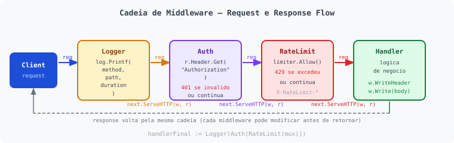


Regra de ouro:
- use `http.Handler` quando quiser **compor comportamento** (middleware, cadeia, reaproveitamento)
- use `http.HandlerFunc` quando quiser **responder rota direto** (simples e rapido)

`http.Handler` e a base de tudo:

```go
type Handler interface {
    ServeHTTP(http.ResponseWriter, *http.Request)
}
```

Nao e funcao.
E comportamento: qualquer tipo que implemente `ServeHTTP` vira handler HTTP.

#### Quando `HandlerFunc` e suficiente

Use funcao direta quando:
- codigo simples
- sem estado interno
- sem composicao de middlewares

```go
package main

import (
	"log"
	"net/http"
)

func ping(w http.ResponseWriter, r *http.Request) {
	_, _ = w.Write([]byte("pong"))
}

func main() {
	http.HandleFunc("/ping", ping)
	log.Fatal(http.ListenAndServe(":8080", nil))
}
```

Executar:

```bash
go run main.go
curl -i localhost:8080/ping
```

#### Exemplo com `ServeHTTP` (tipo customizado)

```go
package main

import (
	"fmt"
	"log"
	"net/http"
)

type helloHandler struct {
	msg string
}

func (h helloHandler) ServeHTTP(w http.ResponseWriter, r *http.Request) {
	_, _ = w.Write([]byte(fmt.Sprintf("%s | path=%s", h.msg, r.URL.Path)))
}

func main() {
	h := helloHandler{msg: "handler custom implementando ServeHTTP"}
	http.Handle("/hello", h)
	log.Fatal(http.ListenAndServe(":8080", nil))
}
```

Executar:

```bash
go run main.go
curl -i localhost:8080/hello
```

#### Exemplo com `http.Handler` para composicao (struct + `handlerFinal`)

```go
package main

import (
	"log"
	"net/http"
)

type LoggerMiddleware struct {
	next http.Handler
}

func (l LoggerMiddleware) ServeHTTP(w http.ResponseWriter, r *http.Request) {
	log.Printf("%s %s", r.Method, r.URL.Path)
	l.next.ServeHTTP(w, r)
}

func getUser(w http.ResponseWriter, r *http.Request) {
	w.Header().Set("Content-Type", "application/json")
	_, _ = w.Write([]byte(`{"name":"Jeff","email":"jeff@email.com"}`))
}

func main() {
	mux := http.NewServeMux()
	mux.HandleFunc("GET /api/v1/user", getUser)

	handlerFinal := LoggerMiddleware{next: mux}
	srv := &http.Server{
		Addr:    ":8080",
		Handler: handlerFinal,
	}

	log.Fatal(srv.ListenAndServe())
}
```

Executar:

```bash
go run main.go
curl -i localhost:8080/api/v1/user
```

#### Mesma composicao, outra forma (middleware func + `handlerFinal`)

```go
package main

import (
	"log"
	"net/http"
)

func loggingMiddleware(next http.Handler) http.Handler {
	return http.HandlerFunc(func(w http.ResponseWriter, r *http.Request) {
		log.Printf("%s %s", r.Method, r.URL.Path)
		next.ServeHTTP(w, r)
	})
}

func getUser(w http.ResponseWriter, r *http.Request) {
	w.Header().Set("Content-Type", "application/json")
	_, _ = w.Write([]byte(`{"name":"Jeff","email":"jeff@email.com"}`))
}

func main() {
	mux := http.NewServeMux()
	mux.HandleFunc("GET /api/v1/user", getUser)

	handlerFinal := loggingMiddleware(mux)
	srv := &http.Server{
		Addr:    ":8080",
		Handler: handlerFinal,
	}

	log.Fatal(srv.ListenAndServe())
}
```

Executar:

```bash
go run main.go
curl -i localhost:8080/api/v1/user
```


### 4.7 Graceful Shutdown

Ao chamar `log.Fatal(srv.ListenAndServe())`, o servidor encerra imediatamente ao receber um sinal do OS (SIGINT, SIGTERM). Isso corta conexões abertas abruptamente. `Shutdown` permite que o servidor termine as requisições em andamento antes de fechar.

```go
package main

import (
	"context"
	"fmt"
	"log"
	"net/http"
	"os"
	"os/signal"
	"syscall"
	"time"
)

func main() {
	mux := http.NewServeMux()
	mux.HandleFunc("GET /ping", func(w http.ResponseWriter, r *http.Request) {
		_, _ = w.Write([]byte("pong"))
	})

	srv := &http.Server{
		Addr:              ":8080",
		Handler:           mux,
		ReadHeaderTimeout: 5 * time.Second,
		ReadTimeout:       15 * time.Second,
		WriteTimeout:      15 * time.Second,
		IdleTimeout:       60 * time.Second,
	}

	// Canal que recebe sinais do OS
	quit := make(chan os.Signal, 1)
	signal.Notify(quit, syscall.SIGINT, syscall.SIGTERM)

	// Sobe o servidor em goroutine separada
	go func() {
		fmt.Println("Server listening on :8080")
		if err := srv.ListenAndServe(); err != nil && err != http.ErrServerClosed {
			log.Fatalf("listen: %v", err)
		}
	}()

	// Bloqueia até receber sinal
	<-quit
	fmt.Println("Shutting down server...")

	// Contexto com timeout para o shutdown
	ctx, cancel := context.WithTimeout(context.Background(), 10*time.Second)
	defer cancel()

	if err := srv.Shutdown(ctx); err != nil {
		log.Fatalf("Server forced to shutdown: %v", err)
	}

	fmt.Println("Server exited cleanly")
}
```

Executar:

```bash
go run main.go
# Em outro terminal:
curl -i localhost:8080/ping
# Para encerrar com graceful shutdown:
Ctrl+C
```

Pontos importantes:
- `signal.Notify` captura `SIGINT` (Ctrl+C) e `SIGTERM` (usado por Docker/Kubernetes)
- `srv.ListenAndServe()` retorna `http.ErrServerClosed` quando `Shutdown` é chamado; isso é esperado, não é erro
- O `context.WithTimeout(10s)` garante que o servidor não fique esperando indefinidamente
- Em Kubernetes, o `SIGTERM` é enviado antes de remover o pod do load balancer; o graceful shutdown dá tempo para as requisições em andamento terminarem

### 4.8 Testando handlers com `httptest`

O pacote `net/http/httptest` permite testar handlers sem subir um servidor real na porta. É o padrão da comunidade Go para testes de API.

```go
package main

import (
	"encoding/json"
	"net/http"
	"net/http/httptest"
	"strings"
	"testing"
)

// Handler que queremos testar
func createUserHandler(w http.ResponseWriter, r *http.Request) {
	if !strings.HasPrefix(r.Header.Get("Content-Type"), "application/json") {
		w.WriteHeader(http.StatusUnsupportedMediaType)
		_, _ = w.Write([]byte(`{"error":"unsupported_media_type"}`))
		return
	}
	var input struct {
		Name  string `json:"name"`
		Email string `json:"email"`
	}
	if err := json.NewDecoder(r.Body).Decode(&input); err != nil {
		w.WriteHeader(http.StatusBadRequest)
		_, _ = w.Write([]byte(`{"error":"invalid_json"}`))
		return
	}
	if input.Name == "" || input.Email == "" {
		w.WriteHeader(http.StatusUnprocessableEntity)
		_, _ = w.Write([]byte(`{"error":"validation_error"}`))
		return
	}
	w.Header().Set("Content-Type", "application/json")
	w.WriteHeader(http.StatusCreated)
	_, _ = w.Write([]byte(`{"message":"user created"}`))
}

func TestCreateUserHandler(t *testing.T) {
	tests := []struct {
		name       string
		body       string
		contentType string
		wantStatus int
	}{
		{
			name:        "sucesso",
			body:        `{"name":"Jeff","email":"jeff@email.com"}`,
			contentType: "application/json",
			wantStatus:  http.StatusCreated,
		},
		{
			name:        "content-type errado",
			body:        `{"name":"Jeff","email":"jeff@email.com"}`,
			contentType: "text/plain",
			wantStatus:  http.StatusUnsupportedMediaType,
		},
		{
			name:        "campos faltando",
			body:        `{"name":"Jeff"}`,
			contentType: "application/json",
			wantStatus:  http.StatusUnprocessableEntity,
		},
		{
			name:        "json invalido",
			body:        `{invalid}`,
			contentType: "application/json",
			wantStatus:  http.StatusBadRequest,
		},
	}

	for _, tt := range tests {
		t.Run(tt.name, func(t *testing.T) {
			req := httptest.NewRequest(http.MethodPost, "/api/v1/users",
				strings.NewReader(tt.body))
			req.Header.Set("Content-Type", tt.contentType)

			rec := httptest.NewRecorder()
			createUserHandler(rec, req)

			if rec.Code != tt.wantStatus {
				t.Errorf("status = %d, want %d", rec.Code, tt.wantStatus)
			}
		})
	}
}
```

Executar:

```bash
go test -v ./...
```

Componentes do `httptest`:
- `httptest.NewRequest(method, target, body)`: cria uma `*http.Request` para teste sem conexão real
- `httptest.NewRecorder()`: implementa `http.ResponseWriter` e captura status, headers e body
- `rec.Code`: status code escrito pelo handler
- `rec.Body.String()`: body da resposta como string
- `rec.Header()`: headers da resposta


---

## 5. Server API

Nos exemplos da seção 4, cada handler escrevia sua resposta diretamente com `w.Header().Set(...)`, `w.WriteHeader(...)` e `w.Write(...)`. Funciona, mas à medida que a API cresce isso se torna repetitivo e inconsistente: um handler retorna `{"error":"..."}`, outro retorna `{"message":"..."}`, um terceiro esquece o `Content-Type`.

A seção 5 resolve isso com um padrão de resposta centralizado (`writeJSON` e `writeError`), organização de rotas, validação de entrada, health endpoints e autenticação básica. É a evolução natural do que foi construído na seção 4.

**Foco deste bloco:**
- somente lado servidor
- exemplos pequenos para copiar, colar e evoluir
- padronizar API antes de avançar para estrutura maior

**Pontos selecionados:**

| Item |
|---|
| 5.0 helpers.go: funções compartilhadas da seção |
| 5.1 Padronizacao de resposta |
| 5.2 Mapa de erros/status por cenario |
| 5.3 Organizacao de rotas |
| 5.4 Validacao de entrada no servidor |
| 5.5 Health endpoints |
| 5.6 Middleware Basic Auth |
| 5.7 Variáveis de ambiente |
| 5.8 Middleware CORS |
| 5.9 Documentação com OpenAPI/Swagger |

### 5.0 helpers.go: funções compartilhadas

Os exemplos a seguir reutilizam `writeJSON` e `writeError`. Em vez de redeclarar em cada arquivo, extraia para um `helpers.go` no mesmo pacote:

```go
// helpers.go
package main

import (
	"encoding/json"
	"net/http"
)

type APIError struct {
	Code    string `json:"code"`
	Message string `json:"message"`
}

func writeJSON(w http.ResponseWriter, status int, payload any) {
	b, err := json.Marshal(payload)
	if err != nil {
		w.Header().Set("Content-Type", "application/json")
		w.WriteHeader(http.StatusInternalServerError)
		_, _ = w.Write([]byte(`{"error":{"code":"internal_error","message":"json_encode_failed"}}`))
		return
	}
	w.Header().Set("Content-Type", "application/json")
	w.WriteHeader(status)
	_, _ = w.Write(b)
}

func writeError(w http.ResponseWriter, status int, code, message string) {
	writeJSON(w, status, map[string]any{
		"error": APIError{Code: code, Message: message},
	})
}
```

A partir daqui, todos os exemplos assumem que `writeJSON` e `writeError` estão disponíveis via `helpers.go` no mesmo pacote.

### 5.1 Padronizacao de resposta

**Objetivo:**
- centralizar escrita de resposta em um ponto unico
- evitar repeticao de `Header`, `WriteHeader`, `Write`
- manter formato consistente de sucesso e erro

```go
package main

import (
	"encoding/json"
	"log"
	"net/http"
)

type APIError struct {
	Code    string `json:"code"`
	Message string `json:"message"`
}

func writeJSON(w http.ResponseWriter, status int, payload any) {
	b, err := json.Marshal(payload)
	if err != nil {
		w.Header().Set("Content-Type", "application/json")
		w.WriteHeader(http.StatusInternalServerError)
		_, _ = w.Write([]byte(`{"error":{"code":"internal_error","message":"json_encode_failed"}}`))
		return
	}

	w.Header().Set("Content-Type", "application/json")
	w.WriteHeader(status)
	_, _ = w.Write(b)
}

func writeError(w http.ResponseWriter, status int, code, message string) {
	writeJSON(w, status, map[string]any{
		"error": APIError{
			Code:    code,
			Message: message,
		},
	})
}

func okHandler(w http.ResponseWriter, r *http.Request) {
	writeJSON(w, http.StatusOK, map[string]any{
		"message": "ok",
		"data":    map[string]string{"course": "net/http"},
	})
}

func badHandler(w http.ResponseWriter, r *http.Request) {
	writeError(w, http.StatusBadRequest, "invalid_input", "missing required field")
}

func main() {
	mux := http.NewServeMux()
	mux.HandleFunc("GET /ok", okHandler)
	mux.HandleFunc("GET /bad", badHandler)

	log.Fatal(http.ListenAndServe(":8080", mux))
}
```

Executar:

```bash
go run main.go
curl -i localhost:8080/ok
curl -i localhost:8080/bad
```

### 5.2 Mapa de erros e status por cenario

| Cenario | Status | Quando usar |
|---|---:|---|
| JSON inválido | `400` | Body malformado |
| Campo inválido / faltando | `422` | Body válido, mas regra de negócio inválida |
| Content-Type incorreto | `415` | Esperava `application/json` |
| Recurso não encontrado | `404` | ID/path não existe |
| Método não permitido | `405` | Endpoint existe, método não |
| Conflito de estado | `409` | Ex.: email já cadastrado |
| Erro interno | `500` | Falha inesperada no servidor |

Exemplo de retorno de erro padronizado:

```go
package main

import (
	"encoding/json"
	"log"
	"net/http"
)

type APIError struct {
	Code    string `json:"code"`
	Message string `json:"message"`
}

func writeJSON(w http.ResponseWriter, status int, payload any) {
	b, err := json.Marshal(payload)
	if err != nil {
		w.Header().Set("Content-Type", "application/json")
		w.WriteHeader(http.StatusInternalServerError)
		_, _ = w.Write([]byte(`{"error":{"code":"internal_error","message":"json_encode_failed"}}`))
		return
	}

	w.Header().Set("Content-Type", "application/json")
	w.WriteHeader(status)
	_, _ = w.Write(b)
}

func writeError(w http.ResponseWriter, status int, code, message string) {
	writeJSON(w, status, map[string]any{
		"error": APIError{
			Code:    code,
			Message: message,
		},
	})
}

func errorByScenario(w http.ResponseWriter, r *http.Request) {
	switch r.PathValue("scenario") {
	case "bad-json":
		writeError(w, http.StatusBadRequest, "invalid_json", "malformed request body")
	case "validation":
		writeError(w, http.StatusUnprocessableEntity, "validation_error", "name and email are required")
	case "content-type":
		writeError(w, http.StatusUnsupportedMediaType, "unsupported_media_type", "use application/json")
	case "not-found":
		writeError(w, http.StatusNotFound, "not_found", "resource not found")
	case "method":
		writeError(w, http.StatusMethodNotAllowed, "method_not_allowed", "method not allowed for this endpoint")
	case "conflict":
		writeError(w, http.StatusConflict, "conflict", "email already exists")
	default:
		writeError(w, http.StatusInternalServerError, "internal_error", "unexpected server error")
	}
}

func main() {
	mux := http.NewServeMux()
	mux.HandleFunc("GET /error/{scenario}", errorByScenario)

	log.Fatal(http.ListenAndServe(":8080", mux))
}
```

Executar:

```bash
go run main.go
curl -i localhost:8080/error/bad-json
curl -i localhost:8080/error/validation
curl -i localhost:8080/error/not-found
```

### 5.3 Organizacao de rotas

Objetivo:
- manter rotas previsiveis
- separar por contexto (`health`, `users`, etc.)
- versionar API (`/api/v1`)

```go
package main

import (
	"log"
	"net/http"
)

func registerRoutes(mux *http.ServeMux) {
	// Health
	mux.HandleFunc("GET /healthz", healthz)
	mux.HandleFunc("GET /readyz", readyz)
	mux.HandleFunc("GET /livez", livez)

	// API v1 - users
	mux.HandleFunc("POST /api/v1/users", createUser)
	mux.HandleFunc("GET /api/v1/users/{id}", getUserByID)
	mux.HandleFunc("PUT /api/v1/users/{id}", updateUser)
}

func healthz(w http.ResponseWriter, r *http.Request) {
	_, _ = w.Write([]byte("ok"))
}

func readyz(w http.ResponseWriter, r *http.Request) {
	_, _ = w.Write([]byte("ready"))
}

func livez(w http.ResponseWriter, r *http.Request) {
	_, _ = w.Write([]byte("alive"))
}

func createUser(w http.ResponseWriter, r *http.Request) {
	w.WriteHeader(http.StatusCreated)
	_, _ = w.Write([]byte(`{"message":"user created"}`))
}

func getUserByID(w http.ResponseWriter, r *http.Request) {
	id := r.PathValue("id")
	_, _ = w.Write([]byte(`{"id":"` + id + `"}`))
}

func updateUser(w http.ResponseWriter, r *http.Request) {
	id := r.PathValue("id")
	_, _ = w.Write([]byte(`{"message":"user updated","id":"` + id + `"}`))
}

func main() {
	mux := http.NewServeMux()
	registerRoutes(mux)

	log.Fatal(http.ListenAndServe(":8080", mux))
}
```

Dica:
- se usar `{id}` no pattern (Go 1.22+), leia com `r.PathValue("id")`

Executar:

```bash
go run main.go
curl -i localhost:8080/healthz
curl -i localhost:8080/api/v1/users/123
```

### 5.4 Validacao de entrada no servidor

Checklist curto para `POST/PUT`:
1. validar `Content-Type`
2. limitar tamanho do body
3. decodificar JSON com `DisallowUnknownFields`
4. validar campos obrigatorios
5. retornar status correto (`400`, `415`, `422`)

```go
package main

import (
	"encoding/json"
	"log"
	"net/http"
	"strings"
)

type APIError struct {
	Code    string `json:"code"`
	Message string `json:"message"`
}

type CreateUserInput struct {
	Name  string `json:"name"`
	Email string `json:"email"`
}

func writeJSON(w http.ResponseWriter, status int, payload any) {
	b, err := json.Marshal(payload)
	if err != nil {
		w.Header().Set("Content-Type", "application/json")
		w.WriteHeader(http.StatusInternalServerError)
		_, _ = w.Write([]byte(`{"error":{"code":"internal_error","message":"json_encode_failed"}}`))
		return
	}

	w.Header().Set("Content-Type", "application/json")
	w.WriteHeader(status)
	_, _ = w.Write(b)
}

func writeError(w http.ResponseWriter, status int, code, message string) {
	writeJSON(w, status, map[string]any{
		"error": APIError{
			Code:    code,
			Message: message,
		},
	})
}

func createUser(w http.ResponseWriter, r *http.Request) {
	if !strings.HasPrefix(r.Header.Get("Content-Type"), "application/json") {
		writeError(w, http.StatusUnsupportedMediaType, "unsupported_media_type", "use application/json")
		return
	}

	r.Body = http.MaxBytesReader(w, r.Body, 1<<20) // 1MB

	var in CreateUserInput
	dec := json.NewDecoder(r.Body)
	dec.DisallowUnknownFields()
	if err := dec.Decode(&in); err != nil {
		writeError(w, http.StatusBadRequest, "invalid_json", "malformed request body")
		return
	}

	if strings.TrimSpace(in.Name) == "" || strings.TrimSpace(in.Email) == "" {
		writeError(w, http.StatusUnprocessableEntity, "validation_error", "name and email are required")
		return
	}

	writeJSON(w, http.StatusCreated, map[string]any{
		"message": "user created",
		"user":    in,
	})
}

func main() {
	mux := http.NewServeMux()
	mux.HandleFunc("POST /api/v1/users", createUser)

	log.Fatal(http.ListenAndServe(":8080", mux))
}
```

Executar:

```bash
go run main.go
curl -i -X POST localhost:8080/api/v1/users \
  -H "Content-Type: application/json" \
  -d '{"name":"Jeff","email":"jeff@email.com"}'
curl -i -X POST localhost:8080/api/v1/users \
  -H "Content-Type: application/json" \
  -d '{"name":"Jeff","email":"jeff@email.com","extra":"x"}'
```

### 5.5 Health endpoints

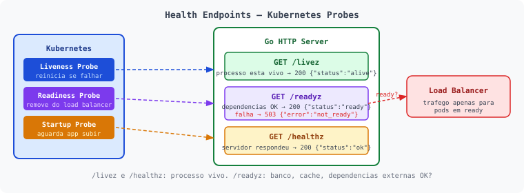


Padrao simples:
- `GET /healthz`: servidor respondeu (up)
- `GET /livez`: processo vivo
- `GET /readyz`: pronto para receber trafego (dependencias OK)

```go
package main

import (
	"encoding/json"
	"log"
	"net/http"
	"time"
)

type APIError struct {
	Code    string `json:"code"`
	Message string `json:"message"`
}

var ready = true

func writeJSON(w http.ResponseWriter, status int, payload any) {
	b, err := json.Marshal(payload)
	if err != nil {
		w.Header().Set("Content-Type", "application/json")
		w.WriteHeader(http.StatusInternalServerError)
		_, _ = w.Write([]byte(`{"error":{"code":"internal_error","message":"json_encode_failed"}}`))
		return
	}

	w.Header().Set("Content-Type", "application/json")
	w.WriteHeader(status)
	_, _ = w.Write(b)
}

func writeError(w http.ResponseWriter, status int, code, message string) {
	writeJSON(w, status, map[string]any{
		"error": APIError{
			Code:    code,
			Message: message,
		},
	})
}

func healthz(w http.ResponseWriter, r *http.Request) {
	writeJSON(w, http.StatusOK, map[string]string{"status": "ok"})
}

func livez(w http.ResponseWriter, r *http.Request) {
	writeJSON(w, http.StatusOK, map[string]string{"status": "alive"})
}

func readyz(w http.ResponseWriter, r *http.Request) {
	if !ready {
		writeError(w, http.StatusServiceUnavailable, "not_ready", "dependencies are not ready")
		return
	}

	writeJSON(w, http.StatusOK, map[string]string{"status": "ready"})
}

func main() {
	mux := http.NewServeMux()
	mux.HandleFunc("GET /healthz", healthz)
	mux.HandleFunc("GET /readyz", readyz)
	mux.HandleFunc("GET /livez", livez)

	srv := &http.Server{
		Addr:              ":8080",
		Handler:           mux,
		ReadHeaderTimeout: 5 * time.Second,
		ReadTimeout:       10 * time.Second,
		WriteTimeout:      10 * time.Second,
		IdleTimeout:       60 * time.Second,
	}

	log.Fatal(srv.ListenAndServe())
}
```

Executar:

```bash
go run main.go
curl -i localhost:8080/healthz
curl -i localhost:8080/readyz
curl -i localhost:8080/livez
```

### 5.6 Middleware Basic Auth

Quando usar (simples e didático):
- proteger endpoint interno de laboratório/homologação
- testar autenticação HTTP básica antes de adotar JWT/OAuth2

```go
package main

import (
	"crypto/subtle"
	"log"
	"net/http"
	"os"
)

func unauthorized(w http.ResponseWriter) {
	w.Header().Set("WWW-Authenticate", `Basic realm="api", charset="UTF-8"`)
	w.Header().Set("Content-Type", "application/json")
	w.WriteHeader(http.StatusUnauthorized)
	_, _ = w.Write([]byte(`{"error":"unauthorized"}`))
}

func basicAuthMiddleware(next http.Handler) http.Handler {
	// Lê credenciais de variáveis de ambiente
	expectedUser := os.Getenv("API_USER")
	expectedPass := os.Getenv("API_PASS")

	return http.HandlerFunc(func(w http.ResponseWriter, r *http.Request) {
		user, pass, ok := r.BasicAuth()
		if !ok {
			unauthorized(w)
			return
		}
		userOK := subtle.ConstantTimeCompare([]byte(user), []byte(expectedUser)) == 1
		passOK := subtle.ConstantTimeCompare([]byte(pass), []byte(expectedPass)) == 1
		if !userOK || !passOK {
			unauthorized(w)
			return
		}
		next.ServeHTTP(w, r)
	})
}

func getUser(w http.ResponseWriter, r *http.Request) {
	w.Header().Set("Content-Type", "application/json")
	_, _ = w.Write([]byte(`{"name":"Jeff","email":"jeff@email.com"}`))
}

func main() {
	mux := http.NewServeMux()
	mux.HandleFunc("GET /api/v1/user", getUser)
	handlerFinal := basicAuthMiddleware(mux)
	log.Fatal(http.ListenAndServe(":8080", handlerFinal))
}
```

Executar:

```bash
API_USER=admin API_PASS=s3cr3t go run main.go
curl -i localhost:8080/api/v1/user
curl -i -u admin:s3cr3t localhost:8080/api/v1/user
```

### 5.7 Variáveis de ambiente

Em produção, configurações sensíveis (credenciais, portas, URLs de banco) nunca devem ser hardcoded. Go oferece `os.Getenv` e `os.LookupEnv` para isso.

| Função | Comportamento |
|---|---|
| `os.Getenv("KEY")` | Retorna o valor ou `""` se não existir |
| `os.LookupEnv("KEY")` | Retorna valor + bool `ok`, distingue "não definida" de "definida vazia" |

```go
package main

import (
	"fmt"
	"log"
	"net/http"
	"os"
)

func main() {
	// Porta com fallback
	port := os.Getenv("PORT")
	if port == "" {
		port = "8080"
	}

	// Variável obrigatória: para se não estiver definida
	dbURL, ok := os.LookupEnv("DATABASE_URL")
	if !ok {
		log.Fatal("DATABASE_URL não definida")
	}

	// Variável opcional com fallback
	env := os.Getenv("APP_ENV")
	if env == "" {
		env = "development"
	}

	fmt.Printf("Iniciando em :%s (env=%s db=%s)\n", port, env, dbURL)

	mux := http.NewServeMux()
	mux.HandleFunc("GET /ping", func(w http.ResponseWriter, r *http.Request) {
		_, _ = w.Write([]byte("pong"))
	})

	log.Fatal(http.ListenAndServe(":"+port, mux))
}
```

Executar:

```bash
PORT=9090 APP_ENV=production DATABASE_URL=postgres://localhost/mydb go run main.go
curl -i localhost:9090/ping
```

Em Docker:

```dockerfile
ENV PORT=8080
ENV APP_ENV=production
```

Ou via `docker run`:

```bash
docker run -e PORT=9090 -e DATABASE_URL=postgres://... -p 9090:9090 nethttp-server:local
```

Boas práticas:
- use `LookupEnv` para variáveis obrigatórias: o servidor falha imediatamente se estiver mal configurado
- use `Getenv` com fallback para opcionais com valor padrão sensato
- nunca logue o valor de variáveis sensíveis (senhas, tokens)
- em desenvolvimento, use um arquivo `.env` com uma biblioteca como `godotenv`; nunca faça commit desse arquivo


### 5.8 Middleware CORS

CORS (Cross-Origin Resource Sharing) é um mecanismo de segurança do browser que bloqueia requisições feitas de uma origem diferente da API. Toda API consumida por um frontend web precisa lidar com isso.

**Como funciona:**

1. O browser envia uma requisição `OPTIONS` (preflight) antes de `POST/PUT/DELETE` com headers customizados
2. O servidor responde com os headers `Access-Control-*` indicando o que é permitido
3. O browser libera (ou bloqueia) a requisição real com base nessa resposta

```go
package main

import (
	"log"
	"net/http"
)

func corsMiddleware(next http.Handler) http.Handler {
	return http.HandlerFunc(func(w http.ResponseWriter, r *http.Request) {
		// Permite qualquer origem (restrinja em produção)
		w.Header().Set("Access-Control-Allow-Origin", "*")
		w.Header().Set("Access-Control-Allow-Methods", "GET, POST, PUT, PATCH, DELETE, OPTIONS")
		w.Header().Set("Access-Control-Allow-Headers", "Content-Type, Authorization, X-Trace-Id")

		// Responde ao preflight e encerra
		if r.Method == http.MethodOptions {
			w.WriteHeader(http.StatusNoContent)
			return
		}

		next.ServeHTTP(w, r)
	})
}

func main() {
	mux := http.NewServeMux()
	mux.HandleFunc("GET /api/v1/users", func(w http.ResponseWriter, r *http.Request) {
		w.Header().Set("Content-Type", "application/json")
		_, _ = w.Write([]byte(`[{"name":"Jeff","email":"jeff@email.com"}]`))
	})

	// CORS aplicado em toda a API
	handlerFinal := corsMiddleware(mux)
	log.Fatal(http.ListenAndServe(":8080", handlerFinal))
}
```

Executar:

```bash
go run main.go

# Simula preflight do browser
curl -i -X OPTIONS localhost:8080/api/v1/users \
  -H "Origin: http://localhost:3000" \
  -H "Access-Control-Request-Method: POST" \
  -H "Access-Control-Request-Headers: Content-Type"

# Requisição normal
curl -i localhost:8080/api/v1/users -H "Origin: http://localhost:3000"
```

| Header | O que controla |
|---|---|
| `Access-Control-Allow-Origin` | Quais origens podem acessar (`*` = qualquer, ou `https://meusite.com`) |
| `Access-Control-Allow-Methods` | Quais verbos HTTP são permitidos |
| `Access-Control-Allow-Headers` | Quais headers o cliente pode enviar |
| `Access-Control-Max-Age` | Quanto tempo o browser pode cachear o preflight (segundos) |

**Em produção:** substitua `"*"` pela origem real do seu frontend. Usar `"*"` com credenciais (`Authorization`) não funciona, pois o browser exige origem explícita nesse caso.

### 5.9 Documentação com OpenAPI/Swagger

#### Um pouco de história

Em 2010, Tony Tam criou o Swagger enquanto trabalhava na Wordnik para resolver um problema simples: como descrever uma API REST de forma que humanos e máquinas entendessem. A solução foi um arquivo de especificação em JSON/YAML que descrevia endpoints, parâmetros, schemas e respostas.

Em 2015, a especificação foi doada para a OpenAPI Initiative (parte da Linux Foundation) e renomeada para OpenAPI Specification. O nome Swagger continuou popular, mas tecnicamente refere-se às ferramentas (Swagger UI, Swagger Editor), não à especificação.

| Versão | Ano | Destaques |
|---|---:|---|
| Swagger 1.x | 2010 | Origem na Wordnik, formato proprietário |
| Swagger 2.0 | 2014 | Padronização ampla, adoção massiva |
| OpenAPI 3.0 | 2017 | Reestruturado, suporte a webhooks e links |
| OpenAPI 3.1 | 2021 | Alinhamento total com JSON Schema |

Hoje OpenAPI 3.1 é o padrão. Quando alguém diz "gerar o Swagger", geralmente quer dizer "gerar o arquivo OpenAPI".

**Por que importa:**
- outros times conseguem consumir sua API sem pedir explicação
- clientes SDK podem ser gerados automaticamente
- serve como contrato vivo entre frontend e backend
- facilita testes manuais via interface web

**Com `swaggo/swag` em Go:**

```bash
# Instala o gerador
go install github.com/swaggo/swag/cmd/swag@latest

# Adiciona dependências ao projeto
go get github.com/swaggo/http-swagger
go get github.com/swaggo/swag
```

Anote os handlers com comentários especiais:

```go
package main

import (
	"log"
	"net/http"

	_ "meuprojeto/docs" // gerado pelo swag
	httpSwagger "github.com/swaggo/http-swagger"
)

// @title           API de Usuários
// @version         1.0
// @description     Exemplo de API documentada com Swagger
// @host            localhost:8080
// @BasePath        /api/v1

// getUsers godoc
// @Summary      Lista usuários
// @Description  Retorna todos os usuários cadastrados
// @Tags         users
// @Produce      json
// @Success      200  {array}   User
// @Failure      500  {object}  APIError
// @Router       /users [get]
func getUsers(w http.ResponseWriter, r *http.Request) {
	w.Header().Set("Content-Type", "application/json")
	_, _ = w.Write([]byte(`[{"name":"Jeff","email":"jeff@email.com"}]`))
}

func main() {
	mux := http.NewServeMux()
	mux.HandleFunc("GET /api/v1/users", getUsers)

	// Serve a interface Swagger UI em /swagger/
	mux.Handle("GET /swagger/", httpSwagger.WrapHandler)

	log.Fatal(http.ListenAndServe(":8080", mux))
}
```

Gerar a documentação:

```bash
# Gera a pasta docs/ com o JSON/YAML do OpenAPI
swag init

# Sobe o servidor
go run main.go

# Acessa a interface visual
open http://localhost:8080/swagger/index.html
```

**Fluxo de trabalho recomendado:**

| Etapa | Ação |
|---|---|
| 1 | Escreve o handler com anotações `// @...` |
| 2 | Roda `swag init` para regenerar `docs/` |
| 3 | Faz commit do `docs/` junto com o código |
| 4 | CI/CD pode validar que o `docs/` está atualizado |

**Alternativas ao swaggo:**

| Ferramenta | Abordagem | Polui o código? |
|---|---|:---:|
| `swaggo/swag` | Anotações em comentários Go, gera OpenAPI 2.0/3.0 | Sim |
| `deepmap/oapi-codegen` | Contract-first: gera código Go a partir do YAML OpenAPI | Não |
| `huma` | Framework que gera OpenAPI automaticamente via tipos Go | Não |
| YAML manual + handler estático | Você escreve o contrato, Go serve o arquivo | Não |
| Postman → OpenAPI | Exporta collection do Postman e converte para YAML | Não |

---

#### Alternativa 1: YAML manual + Swagger UI sem dependência

A abordagem mais limpa. Você escreve o `openapi.yaml` à mão (ou via editor online), commita no repositório e serve com um único handler Go. Zero anotações no código, zero dependências extras.

**Passo 1: Escreve o contrato no Swagger Editor online:**

Acesse [editor.swagger.io](https://editor.swagger.io), escreva ou cole seu YAML e valide em tempo real. Quando estiver pronto, baixe o arquivo.

```yaml
# openapi.yaml: salve na raiz ou em docs/openapi.yaml
openapi: "3.0.3"
info:
  title: API de Usuários
  version: "1.0.0"
paths:
  /api/v1/users:
    get:
      summary: Lista usuários
      responses:
        "200":
          description: Lista de usuários
          content:
            application/json:
              schema:
                type: array
                items:
                  $ref: "#/components/schemas/User"
  /api/v1/users/{id}:
    get:
      summary: Busca usuário por ID
      parameters:
        - name: id
          in: path
          required: true
          schema:
            type: string
      responses:
        "200":
          description: Usuário encontrado
        "404":
          description: Não encontrado
components:
  schemas:
    User:
      type: object
      properties:
        name:
          type: string
        email:
          type: string
```

**Passo 2: Serve o YAML e a UI via Go (zero dependências):**

```go
package main

import (
	"log"
	"net/http"
)

func main() {
	mux := http.NewServeMux()

	// Rotas da API
	mux.HandleFunc("GET /api/v1/users", func(w http.ResponseWriter, r *http.Request) {
		w.Header().Set("Content-Type", "application/json")
		_, _ = w.Write([]byte(`[{"name":"Jeff","email":"jeff@email.com"}]`))
	})

	// Serve o arquivo openapi.yaml diretamente
	mux.HandleFunc("GET /openapi.yaml", func(w http.ResponseWriter, r *http.Request) {
		w.Header().Set("Content-Type", "application/yaml")
		http.ServeFile(w, r, "docs/openapi.yaml")
	})

	// Serve Swagger UI via CDN (HTML puro, sem dependência Go)
	mux.HandleFunc("GET /docs", func(w http.ResponseWriter, r *http.Request) {
		w.Header().Set("Content-Type", "text/html")
		_, _ = w.Write([]byte(`<!DOCTYPE html>
<html>
<head>
  <title>API Docs</title>
  <link rel="stylesheet" href="https://unpkg.com/swagger-ui-dist/swagger-ui.css"/>
</head>
<body>
  <div id="swagger-ui"></div>
  <script src="https://unpkg.com/swagger-ui-dist/swagger-ui-bundle.js"></script>
  <script>
    SwaggerUIBundle({ url: "/openapi.yaml", dom_id: "#swagger-ui" })
  </script>
</body>
</html>`))
	})

	log.Println("Docs em http://localhost:8080/docs")
	log.Fatal(http.ListenAndServe(":8080", mux))
}
```

Executar:

```bash
go run main.go
open http://localhost:8080/docs
```

Ou serve via Redoc (visual mais limpo para documentação pública):

```go
mux.HandleFunc("GET /redoc", func(w http.ResponseWriter, r *http.Request) {
	w.Header().Set("Content-Type", "text/html")
	_, _ = w.Write([]byte(`<!DOCTYPE html>
<html>
<head><title>API Docs</title></head>
<body>
  <redoc spec-url="/openapi.yaml"></redoc>
  <script src="https://cdn.jsdelivr.net/npm/redoc/bundles/redoc.standalone.js"></script>
</body>
</html>`))
})
```

---

#### Alternativa 2: Postman Collection para OpenAPI YAML

Se você já tem uma collection no Postman, é possível converter diretamente para OpenAPI sem escrever o YAML do zero.

**Opção A: Pelo próprio Postman (interface):**

1. Abra a collection no Postman
2. Clique nos três pontos da collection
3. Selecione `Export` → escolha formato `Collection v2.1`
4. Salve como `collection.json`

**Opção B: Converter com script Node (postman-to-openapi):**

```bash
# Instala a ferramenta
npm install -g postman-to-openapi

# Converte collection.json para openapi.yaml
p2o collection.json -f docs/openapi.yaml
```

**Opção C: Converter com script Python:**

```python
#!/usr/bin/env python3
# convert_postman.py
# pip install pyyaml

import json
import yaml
import sys

def postman_to_openapi(collection_path: str, output_path: str):
    with open(collection_path) as f:
        collection = json.load(f)

    info = collection.get("info", {})
    paths = {}

    def extract_items(items, prefix=""):
        for item in items:
            if "item" in item:
                extract_items(item["item"], prefix)
            elif "request" in item:
                req = item["request"]
                url = req.get("url", {})
                raw = url.get("raw", "") if isinstance(url, dict) else url
                # normaliza path params {param} -> {param}
                path = "/" + "/".join(
                    seg.get("value", seg) if isinstance(seg, dict) else seg
                    for seg in (url.get("path", []) if isinstance(url, dict) else [])
                )
                method = req.get("method", "GET").lower()
                paths.setdefault(path, {})[method] = {
                    "summary": item.get("name", ""),
                    "responses": {"200": {"description": "OK"}},
                }

    extract_items(collection.get("item", []))

    spec = {
        "openapi": "3.0.3",
        "info": {"title": info.get("name", "API"), "version": "1.0.0"},
        "paths": paths,
    }

    with open(output_path, "w") as f:
        yaml.dump(spec, f, allow_unicode=True, sort_keys=False)

    print(f"OpenAPI gerado em {output_path}")

if __name__ == "__main__":
    postman_to_openapi(sys.argv[1], sys.argv[2])
```

Executar:

```bash
python3 convert_postman.py collection.json docs/openapi.yaml
```

Depois sirva o `openapi.yaml` com o handler da Alternativa 1. O resultado é uma documentação visual completa sem nenhuma anotação no seu código Go.

---

#### Alternativa 3: Contract-first com oapi-codegen

Escreve o YAML primeiro, gera as interfaces e tipos Go automaticamente. O código fica limpo porque a especificação vive fora do código.

```bash
go install github.com/deepmap/oapi-codegen/cmd/oapi-codegen@latest
oapi-codegen -package api docs/openapi.yaml > api/api.gen.go
```

Go gera as interfaces que você implementa, sem nenhuma anotação e sem nenhum comentário especial.

---

**Qual abordagem escolher:**

| Situação | Recomendação |
|---|---|
| Time já usa Postman | Exporte a collection e converta com `postman-to-openapi` ou o script Python |
| Quer zero dependência Go | YAML manual + `http.ServeFile` + Swagger UI via CDN |
| Quer contrato rigoroso e geração de código | `oapi-codegen` (contract-first) |
| Quer iterar rápido com anotações | `swaggo/swag` (aceita a poluição como tradeoff) |
| Documentação pública bonita | Redoc via CDN sobre o mesmo `openapi.yaml` |

---

## 6. Docker: build e run local

Objetivo:
- compilar o server Go em imagem enxuta (multi-stage)
- subir local na porta `8080`
- ter comandos basicos para operacao e debug

Pre-requisito:
- ter um `main.go` funcional na raiz (voce pode usar qualquer exemplo deste README)
- usar `.dockerignore` para nao enviar arquivos desnecessarios no contexto de build

### 6.1 Dockerfile multi-stage (Alpine + timezone Brasil)

Arquivo `Dockerfile` (na raiz do projeto):

```dockerfile
FROM golang:1.25.6-alpine AS builder
WORKDIR /src
RUN apk add --no-cache ca-certificates
COPY . .
ARG APP_FILE=main.go
ENV CGO_ENABLED=0
RUN go build -trimpath -ldflags="-s -w" -o /out/server "./${APP_FILE}"

FROM alpine:3.20 AS runtime

ENV TZ=America/Sao_Paulo
RUN apk add --no-cache ca-certificates tzdata \
  && ln -snf /usr/share/zoneinfo/$TZ /etc/localtime \
  && echo $TZ > /etc/timezone

WORKDIR /app
COPY --from=builder /out/server /app/server

EXPOSE 8080
USER nobody:nobody
ENTRYPOINT ["/app/server"]
```

Observacoes:
- imagem final fica enxuta (sem toolchain Go)
- timezone definida para Brasil (`America/Sao_Paulo`)
- se seu entrypoint for outro arquivo, use `--build-arg APP_FILE=seu_arquivo.go`
- a imagem do builder deve ser compativel com a versao do `go.mod` (ex.: `go 1.25.6`)

### 6.2 Comandos basicos Docker

Build da imagem:

```bash
docker build -t nethttp-server:local .
```

Build da imagem sem usar cache (forca rebuild):

```bash
docker build --no-cache -t nethttp-server:local .
```

Build escolhendo outro arquivo Go:

```bash
docker build -t nethttp-server:local --build-arg APP_FILE=cmd/api/main.go .
```

Limpar cache de build (builder cache):

```bash
docker builder prune -f
```

Subir container local:

```bash
docker run -d --name nethttp-server -p 8080:8080 nethttp-server:local
```

Listar containers:

```bash
docker ps -a
```

Ver logs:

```bash
docker logs -f nethttp-server
```

Validar rotas:

```bash
curl -i localhost:8080/api/v1/user
```

```bash
curl -i -X POST localhost:8080/api/v1/user \
  -H "Content-Type: application/json" \
  -d '{"name":"Jeff","email":"jeff@email.com"}'
```

```bash
curl -i -X PUT localhost:8080/api/v1/user \
  -H "Content-Type: application/json" \
  -d '{"name":"Jeff Updated","email":"jeff.updated@email.com"}'
```

Conferir timezone no container:

```bash
docker exec -it nethttp-server date
```

Parar e remover container:

```bash
docker stop nethttp-server
docker rm nethttp-server
```

---

<br>

<sub>Feito com dedicação por <a href="https://github.com/jeffotoni">@jeffotoni</a> · Go é a linguagem, ensinar é a missão.</sub>
